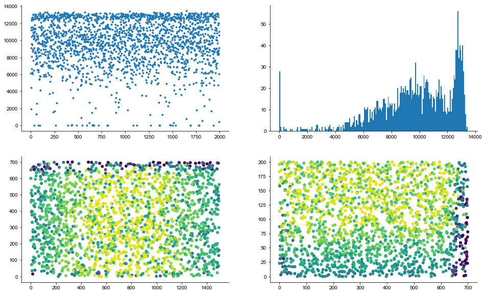
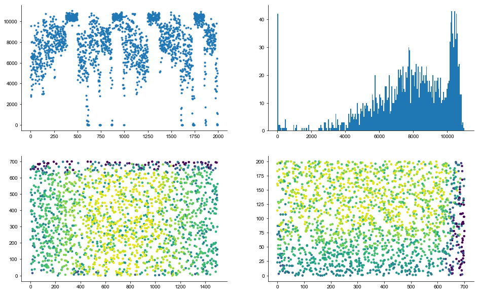

## Parallel fiber - GoC


```python
from pathlib import Path
import numpy as np
import matplotlib.pyplot as plt
from mpl_toolkits.mplot3d import Axes3D

```


```python
output_path = Path.cwd().parent.parent / 'output_2'
```


```python
adend = np.loadtxt(output_path / 'GoCadendcoordinates.dat')
bdend = np.loadtxt(output_path / 'GoCbdendcoordinates.dat')
grcs = np.loadtxt(output_path / "GCcoordinates.sorted.dat")
gcts = np.loadtxt(output_path / "GCTcoordinates.dat")
```


```python
adend = adend.reshape((1995,50,3))
bdend = bdend.reshape((1995,24,3))
```


```python
i = 1
fig = plt.figure()
ax = fig.add_subplot(111, projection='3d')
ax.plot(adend[i][:,0], adend[i][:,1], adend[i][:,2],'.r')
ax.plot(bdend[i][:,0], bdend[i][:,1], bdend[i][:,2],'.k')

i = 1000
ax.plot(adend[i][:,0], adend[i][:,1], adend[i][:,2],'.r')
ax.plot(bdend[i][:,0], bdend[i][:,1], bdend[i][:,2],'.k')
```


```python
data_index = 10

data_dir = output_path
fcoords = "PFtoGoCcoords{}.dat".format(data_index)
fsrcs = "PFtoGoCsources{}.dat".format(data_index)
ftgts = "PFtoGoCtargets{}.dat".format(data_index)
fdsts = "PFtoGoCdistances{}.dat".format(data_index)


xyz = np.loadtxt(data_dir / fcoords)
srcs = np.loadtxt(data_dir / fsrcs).astype(int)
tgts = np.loadtxt(data_dir / ftgts).astype(int)
dsts = np.loadtxt(data_dir / fdsts)
```


```python
i = 4000
tgt = tgts[i]
src = srcs[i]
dst = dsts[i]

pt2 = xyz[i]

print("{} -> {} with d = {}".format(src, tgt, dst))
```


```python
%matplotlib inline
fig = plt.figure()
ax = fig.add_subplot(111, projection='3d')
pt0 = grcs[src]
pt1 = gcts[src]
ax.plot([pt0[0], pt1[0]], [pt0[1], pt1[1]], [pt0[2], pt1[2]], 'o-k')
ax.plot([pt1[0], pt1[0]+1e3], [pt1[1], pt1[1]], [pt1[2], pt1[2]], '-k')
ax.plot([pt1[0], pt1[0]-1e3], [pt1[1], pt1[1]], [pt1[2], pt1[2]], '-k')
ax.plot(adend[tgt][:,0], adend[tgt][:,1], adend[tgt][:,2],'.r')
ax.plot(bdend[tgt][:,0], bdend[tgt][:,1], bdend[tgt][:,2],'.m')
pt2 = xyz[i]
ax.plot([pt2[0]], [pt2[1]], [pt2[2]], 'oc')
# ax.set_xlim([0, 1500])
```


```python
% matplotlib nbagg

fig, ax = plt.subplots(ncols=2, figsize=(10, 5), sharex=False)
ax[0].plot([pt0[0], pt1[0]], [pt0[1], pt1[1]], 'o-k')
ax[0].plot([pt1[0], pt1[0]+1e3], [pt1[1], pt1[1]], '-k')
ax[0].plot([pt1[0], pt1[0]-1e3], [pt1[1], pt1[1]], '-k')
ax[0].plot(adend[tgt][:,0], adend[tgt][:,1], '.r')
ax[0].plot(bdend[tgt][:,0], bdend[tgt][:,1], '.m')
ax[0].plot([pt2[0]], [pt2[1]], 'oc')


ax[1].plot([pt0[0], pt1[0]], [pt0[2], pt1[2]], 'o-k')
ax[1].plot([pt1[0], pt1[0]+1e3], [pt1[2], pt1[2]], '-k')
ax[1].plot([pt1[0], pt1[0]-1e3], [pt1[2], pt1[2]], '-k')
ax[1].plot(adend[tgt][:,0], adend[tgt][:,2],'.r')
ax[1].plot(bdend[tgt][:,0], bdend[tgt][:,2],'.m')
ax[1].plot([pt2[0]], [pt2[2]], 'oc')
```

## Ascending axon - GoC


```python
data_index = 80

data_dir = output_path
fcoords = "AAtoGoCcoords{}.dat".format(data_index)
fsrcs = "AAtoGoCsources{}.dat".format(data_index)
ftgts = "AAtoGoCtargets{}.dat".format(data_index)
fdsts = "AAtoGoCdistances{}.dat".format(data_index)

xyz = np.loadtxt(data_dir / fcoords)
srcs = np.loadtxt(data_dir / fsrcs).astype(int)
tgts = np.loadtxt(data_dir / ftgts).astype(int)
dsts = np.loadtxt(data_dir / fdsts)
```


```python
i = 20
tgt = tgts[i]
src = srcs[i]
dst = dsts[i]

pt2 = xyz[i]

print("{} -> {} with d = {}".format(src, tgt, dst))
```


```python
fig = plt.figure()
ax = fig.add_subplot(111, projection='3d')
pt0 = grcs[src]
pt1 = gcts[src]
ax.plot([pt0[0], pt1[0]], [pt0[1], pt1[1]], [pt0[2], pt1[2]], 'o-k')
ax.plot([pt1[0], pt1[0]+1e3], [pt1[1], pt1[1]], [pt1[2], pt1[2]], '-k')
ax.plot([pt1[0], pt1[0]-1e3], [pt1[1], pt1[1]], [pt1[2], pt1[2]], '-k')
ax.plot(adend[tgt][:,0], adend[tgt][:,1], adend[tgt][:,2],'.r')
ax.plot(bdend[tgt][:,0], bdend[tgt][:,1], bdend[tgt][:,2],'.m')
pt2 = xyz[i]
ax.plot([pt2[0]], [pt2[1]], [pt2[2]], 'oc')
ax.set_xlim([0, 1500])

```


```python
% matplotlib nbagg

fig, ax = plt.subplots(ncols=2, figsize=(10, 5), sharex=True)
ax[0].plot([pt0[0], pt1[0]], [pt0[1], pt1[1]], 'o-k')
ax[0].plot([pt1[0], pt1[0]+1e3], [pt1[1], pt1[1]], '-k')
ax[0].plot([pt1[0], pt1[0]-1e3], [pt1[1], pt1[1]], '-k')
ax[0].plot(adend[tgt][:,0], adend[tgt][:,1], '.r')
ax[0].plot(bdend[tgt][:,0], bdend[tgt][:,1], '.m')
ax[0].plot([pt2[0]], [pt2[1]], 'oc')


ax[1].plot([pt0[0], pt1[0]], [pt0[2], pt1[2]], 'o-k')
ax[1].plot([pt1[0], pt1[0]+1e3], [pt1[2], pt1[2]], '-k')
ax[1].plot([pt1[0], pt1[0]-1e3], [pt1[2], pt1[2]], '-k')
ax[1].plot(adend[tgt][:,0], adend[tgt][:,2],'.r')
ax[1].plot(bdend[tgt][:,0], bdend[tgt][:,2],'.m')
ax[1].plot([pt2[0]], [pt2[2]], 'oc')
```

## Convert big files to the npy format


```python
output_path = Path('/Users/shhong/Dropbox/network_data/output_ines')
# output_path = Path('/Users/shhong/Dropbox/network_data/output_brep')
src = np.loadtxt(output_path / "PFtoGoCsources.dat")
tgt = np.loadtxt(output_path / "PFtoGoCtargets.dat")
src = src.astype(int)
tgt = tgt.astype(int)
```


```python
np.save(output_path / 'PFtoGoCsources.npy', src)
np.save(output_path / 'PFtoGoCtargets.npy', tgt)
```


```python
src = np.loadtxt(output_path.parent / "AAtoGoCsources.dat")
tgt = np.loadtxt(output_path.parent / "AAtoGoCtargets.dat")
src = src.astype(int)
tgt = tgt.astype(int)

np.save(output_path.parent / 'AAtoGoCsources.npy', src)
np.save(output_path.parent / 'AAtoGoCtargets.npy', tgt)
```

## Load back data


```python
output_path = Path('/Users/shhong/Dropbox/network_data/output_ines')

srcs = np.load(output_path / 'PFtoGoCsources.npy')
tgts = np.load(output_path / 'PFtoGoCtargets.npy')

grcxy = np.loadtxt(output_path / 'GCcoordinates.sorted.dat')
gocxy = np.loadtxt(output_path / 'GoCcoordinates.sorted.dat')
```


```python
import dask.dataframe as dd

df = dd.from_array(np.vstack((srcs, tgts)).T, columns=('src', 'tgt'))
```


```python
cons_per_goc = df.groupby('tgt').count().compute()
cons_per_goc
```


<div>
<style scoped>
    .dataframe tbody tr th:only-of-type {
        vertical-align: middle;
    }

    .dataframe tbody tr th {
        vertical-align: top;
    }

    .dataframe thead th {
        text-align: right;
    }
</style>
<table border="1" class="dataframe">
  <thead>
    <tr style="text-align: right;">
      <th></th>
      <th>src</th>
    </tr>
    <tr>
      <th>tgt</th>
      <th></th>
    </tr>
  </thead>
  <tbody>
    <tr>
      <th>0</th>
      <td>6110</td>
    </tr>
    <tr>
      <th>1</th>
      <td>11495</td>
    </tr>
    <tr>
      <th>2</th>
      <td>11195</td>
    </tr>
    <tr>
      <th>3</th>
      <td>4426</td>
    </tr>
    <tr>
      <th>4</th>
      <td>1935</td>
    </tr>
    <tr>
      <th>5</th>
      <td>9096</td>
    </tr>
    <tr>
      <th>6</th>
      <td>10437</td>
    </tr>
    <tr>
      <th>7</th>
      <td>12535</td>
    </tr>
    <tr>
      <th>8</th>
      <td>8100</td>
    </tr>
    <tr>
      <th>9</th>
      <td>12375</td>
    </tr>
    <tr>
      <th>10</th>
      <td>6676</td>
    </tr>
    <tr>
      <th>11</th>
      <td>9618</td>
    </tr>
    <tr>
      <th>12</th>
      <td>12401</td>
    </tr>
    <tr>
      <th>13</th>
      <td>9452</td>
    </tr>
    <tr>
      <th>14</th>
      <td>11593</td>
    </tr>
    <tr>
      <th>15</th>
      <td>12680</td>
    </tr>
    <tr>
      <th>16</th>
      <td>6205</td>
    </tr>
    <tr>
      <th>17</th>
      <td>8678</td>
    </tr>
    <tr>
      <th>18</th>
      <td>6060</td>
    </tr>
    <tr>
      <th>19</th>
      <td>10612</td>
    </tr>
    <tr>
      <th>20</th>
      <td>11243</td>
    </tr>
    <tr>
      <th>21</th>
      <td>12675</td>
    </tr>
    <tr>
      <th>22</th>
      <td>8946</td>
    </tr>
    <tr>
      <th>23</th>
      <td>7630</td>
    </tr>
    <tr>
      <th>24</th>
      <td>8882</td>
    </tr>
    <tr>
      <th>25</th>
      <td>13005</td>
    </tr>
    <tr>
      <th>26</th>
      <td>10966</td>
    </tr>
    <tr>
      <th>27</th>
      <td>13072</td>
    </tr>
    <tr>
      <th>28</th>
      <td>12480</td>
    </tr>
    <tr>
      <th>29</th>
      <td>10125</td>
    </tr>
    <tr>
      <th>...</th>
      <td>...</td>
    </tr>
    <tr>
      <th>1632</th>
      <td>11541</td>
    </tr>
    <tr>
      <th>1633</th>
      <td>6969</td>
    </tr>
    <tr>
      <th>1634</th>
      <td>10505</td>
    </tr>
    <tr>
      <th>1635</th>
      <td>6101</td>
    </tr>
    <tr>
      <th>1636</th>
      <td>11392</td>
    </tr>
    <tr>
      <th>1637</th>
      <td>13015</td>
    </tr>
    <tr>
      <th>1638</th>
      <td>11514</td>
    </tr>
    <tr>
      <th>1639</th>
      <td>7229</td>
    </tr>
    <tr>
      <th>1640</th>
      <td>9882</td>
    </tr>
    <tr>
      <th>1641</th>
      <td>6527</td>
    </tr>
    <tr>
      <th>1642</th>
      <td>5737</td>
    </tr>
    <tr>
      <th>1643</th>
      <td>7709</td>
    </tr>
    <tr>
      <th>1644</th>
      <td>12613</td>
    </tr>
    <tr>
      <th>1645</th>
      <td>13458</td>
    </tr>
    <tr>
      <th>1646</th>
      <td>803</td>
    </tr>
    <tr>
      <th>1647</th>
      <td>11834</td>
    </tr>
    <tr>
      <th>1648</th>
      <td>9783</td>
    </tr>
    <tr>
      <th>1649</th>
      <td>10091</td>
    </tr>
    <tr>
      <th>1650</th>
      <td>11416</td>
    </tr>
    <tr>
      <th>1651</th>
      <td>12780</td>
    </tr>
    <tr>
      <th>1652</th>
      <td>8577</td>
    </tr>
    <tr>
      <th>1653</th>
      <td>9234</td>
    </tr>
    <tr>
      <th>1654</th>
      <td>10450</td>
    </tr>
    <tr>
      <th>1655</th>
      <td>8453</td>
    </tr>
    <tr>
      <th>1656</th>
      <td>7676</td>
    </tr>
    <tr>
      <th>1657</th>
      <td>7408</td>
    </tr>
    <tr>
      <th>1658</th>
      <td>7476</td>
    </tr>
    <tr>
      <th>1659</th>
      <td>9127</td>
    </tr>
    <tr>
      <th>1660</th>
      <td>12863</td>
    </tr>
    <tr>
      <th>1661</th>
      <td>11027</td>
    </tr>
  </tbody>
</table>
<p>1969 rows × 1 columns</p>
</div>


```python
cons_per_pf = df.groupby('src').count().compute()
cons_per_pf
```


<div>
<style scoped>
    .dataframe tbody tr th:only-of-type {
        vertical-align: middle;
    }

    .dataframe tbody tr th {
        vertical-align: top;
    }

    .dataframe thead th {
        text-align: right;
    }
</style>
<table border="1" class="dataframe">
  <thead>
    <tr style="text-align: right;">
      <th></th>
      <th>tgt</th>
    </tr>
    <tr>
      <th>src</th>
      <th></th>
    </tr>
  </thead>
  <tbody>
    <tr>
      <th>28</th>
      <td>21</td>
    </tr>
    <tr>
      <th>51</th>
      <td>22</td>
    </tr>
    <tr>
      <th>56</th>
      <td>16</td>
    </tr>
    <tr>
      <th>89</th>
      <td>28</td>
    </tr>
    <tr>
      <th>121</th>
      <td>24</td>
    </tr>
    <tr>
      <th>125</th>
      <td>31</td>
    </tr>
    <tr>
      <th>140</th>
      <td>6</td>
    </tr>
    <tr>
      <th>143</th>
      <td>16</td>
    </tr>
    <tr>
      <th>158</th>
      <td>34</td>
    </tr>
    <tr>
      <th>164</th>
      <td>21</td>
    </tr>
    <tr>
      <th>206</th>
      <td>31</td>
    </tr>
    <tr>
      <th>218</th>
      <td>37</td>
    </tr>
    <tr>
      <th>223</th>
      <td>30</td>
    </tr>
    <tr>
      <th>246</th>
      <td>1</td>
    </tr>
    <tr>
      <th>322</th>
      <td>32</td>
    </tr>
    <tr>
      <th>344</th>
      <td>28</td>
    </tr>
    <tr>
      <th>346</th>
      <td>26</td>
    </tr>
    <tr>
      <th>366</th>
      <td>23</td>
    </tr>
    <tr>
      <th>367</th>
      <td>40</td>
    </tr>
    <tr>
      <th>377</th>
      <td>41</td>
    </tr>
    <tr>
      <th>390</th>
      <td>13</td>
    </tr>
    <tr>
      <th>391</th>
      <td>39</td>
    </tr>
    <tr>
      <th>409</th>
      <td>38</td>
    </tr>
    <tr>
      <th>452</th>
      <td>29</td>
    </tr>
    <tr>
      <th>453</th>
      <td>11</td>
    </tr>
    <tr>
      <th>460</th>
      <td>24</td>
    </tr>
    <tr>
      <th>474</th>
      <td>40</td>
    </tr>
    <tr>
      <th>490</th>
      <td>32</td>
    </tr>
    <tr>
      <th>495</th>
      <td>30</td>
    </tr>
    <tr>
      <th>561</th>
      <td>28</td>
    </tr>
    <tr>
      <th>...</th>
      <td>...</td>
    </tr>
    <tr>
      <th>708776</th>
      <td>1</td>
    </tr>
    <tr>
      <th>710097</th>
      <td>1</td>
    </tr>
    <tr>
      <th>712550</th>
      <td>1</td>
    </tr>
    <tr>
      <th>713428</th>
      <td>1</td>
    </tr>
    <tr>
      <th>714677</th>
      <td>1</td>
    </tr>
    <tr>
      <th>720751</th>
      <td>1</td>
    </tr>
    <tr>
      <th>720934</th>
      <td>1</td>
    </tr>
    <tr>
      <th>721243</th>
      <td>1</td>
    </tr>
    <tr>
      <th>721789</th>
      <td>1</td>
    </tr>
    <tr>
      <th>721849</th>
      <td>1</td>
    </tr>
    <tr>
      <th>723423</th>
      <td>1</td>
    </tr>
    <tr>
      <th>729263</th>
      <td>1</td>
    </tr>
    <tr>
      <th>731688</th>
      <td>1</td>
    </tr>
    <tr>
      <th>737045</th>
      <td>1</td>
    </tr>
    <tr>
      <th>737676</th>
      <td>1</td>
    </tr>
    <tr>
      <th>743307</th>
      <td>1</td>
    </tr>
    <tr>
      <th>745856</th>
      <td>1</td>
    </tr>
    <tr>
      <th>751627</th>
      <td>1</td>
    </tr>
    <tr>
      <th>755814</th>
      <td>1</td>
    </tr>
    <tr>
      <th>756236</th>
      <td>1</td>
    </tr>
    <tr>
      <th>757768</th>
      <td>1</td>
    </tr>
    <tr>
      <th>761408</th>
      <td>1</td>
    </tr>
    <tr>
      <th>761769</th>
      <td>1</td>
    </tr>
    <tr>
      <th>764795</th>
      <td>1</td>
    </tr>
    <tr>
      <th>771259</th>
      <td>1</td>
    </tr>
    <tr>
      <th>775488</th>
      <td>1</td>
    </tr>
    <tr>
      <th>783282</th>
      <td>1</td>
    </tr>
    <tr>
      <th>784285</th>
      <td>1</td>
    </tr>
    <tr>
      <th>784570</th>
      <td>1</td>
    </tr>
    <tr>
      <th>789146</th>
      <td>1</td>
    </tr>
  </tbody>
</table>
<p>797438 rows × 1 columns</p>
</div>


```python
temp = np.zeros(cons_per_goc.src.index.max()+1)
temp[cons_per_goc.src.index] = cons_per_goc.src.values
```


```python
fig, ax = plt.subplots(ncols=2, nrows=2, figsize=(16, 10))
ax[0,0].plot(temp, '.')
_ = ax[0,1].hist(temp,200)
ax[1,0].scatter(gocxy[:,0], gocxy[:,1], 100, temp, '.')
ax[1,1].scatter(gocxy[:,1], gocxy[:,2], 100, temp, '.')
```


    <matplotlib.collections.PathCollection at 0x122bed8d0>





```python
temp = np.zeros(cons_per_pf.tgt.index.max()+1)
temp[cons_per_pf.tgt.index] = cons_per_pf.tgt.values
```


```python
fig, ax = plt.subplots(ncols=2, nrows=2, figsize=(16, 10))
ax[0,0].plot(temp, '.')
_ = ax[0,1].hist(temp,200)
ax[1,0].scatter(grcxy[:,0], grcxy[:,1], 0.5, temp, '.')
ax[1,1].scatter(grcxy[:,1], grcxy[:,2], 0.5, temp, '.')
```


    <matplotlib.collections.PathCollection at 0x124958cf8>


## Perform the same analysis on BREP outputs


```python
# output_path = Path('/Users/shhong/Dropbox/network_data/output_ines')
output_path = Path('/Users/shhong/Dropbox/network_data/output_brep')
src = np.loadtxt(output_path / "PFtoGoCsources.dat")
tgt = np.loadtxt(output_path / "PFtoGoCtargets.dat")
src = src.astype(int)
tgt = tgt.astype(int)

np.save(output_path / 'PFtoGoCsources.npy', src)
np.save(output_path / 'PFtoGoCtargets.npy', tgt)

src = np.loadtxt(output_path / "AAtoGoCsources.dat")
tgt = np.loadtxt(output_path / "AAtoGoCtargets.dat")
src = src.astype(int)
tgt = tgt.astype(int)

np.save(output_path / 'AAtoGoCsources.npy', src)
np.save(output_path / 'AAtoGoCtargets.npy', tgt)
```


    ---------------------------------------------------------------------------

    KeyboardInterrupt                         Traceback (most recent call last)

    <ipython-input-3-1885f8976804> in <module>()
          1 # output_path = Path('/Users/shhong/Dropbox/network_data/output_ines')
          2 output_path = Path('/Users/shhong/Dropbox/network_data/output_brep')
    ----> 3 src = np.loadtxt(output_path / "PFtoGoCsources.dat")
          4 tgt = np.loadtxt(output_path / "PFtoGoCtargets.dat")
          5 src = src.astype(int)


    /opt/anaconda3/lib/python3.6/site-packages/numpy/lib/npyio.py in loadtxt(fname, dtype, comments, delimiter, converters, skiprows, usecols, unpack, ndmin)
       1011         # Parse each line, including the first
       1012         for i, line in enumerate(itertools.chain([first_line], fh)):
    -> 1013             vals = split_line(line)
       1014             if len(vals) == 0:
       1015                 continue


    /opt/anaconda3/lib/python3.6/site-packages/numpy/lib/npyio.py in split_line(line)
        958         line = asbytes(line)
        959         if comments is not None:
    --> 960             line = regex_comments.split(asbytes(line), maxsplit=1)[0]
        961         line = line.strip(b'\r\n')
        962         if line:


    KeyboardInterrupt: 


```python
output_path = Path('/Users/shhong/Dropbox/network_data/output_brep')

srcs = np.load(output_path / 'PFtoGoCsources.npy')
tgts = np.load(output_path / 'PFtoGoCtargets.npy')
grcxy = np.loadtxt(output_path / 'GCcoordinates.sorted.dat')
gocxy = np.loadtxt(output_path / 'GoCcoordinates.sorted.dat')

df = dd.from_array(np.vstack((srcs, tgts)).T, columns=('src', 'tgt'))
```


```python
cons_per_goc = df.groupby('tgt').count().compute()
cons_per_pf = df.groupby('src').count().compute()

def convert_from_dd(x):
    temp = np.zeros(x.index.max()+1)
    temp[x.index] = x.values
    return temp

cons_per_goc = convert_from_dd(cons_per_goc.src)
cons_per_pf = convert_from_dd(cons_per_pf.tgt)
```


```python
fig, ax = plt.subplots(ncols=2, nrows=2, figsize=(16, 10))
ax[0,0].plot(cons_per_goc, '.')
_ = ax[0,1].hist(cons_per_goc, 200)
ax[1,0].scatter(gocxy[:,0], gocxy[:,1], 100, cons_per_goc, '.')
ax[1,1].scatter(gocxy[:,1], gocxy[:,2], 100, cons_per_goc, '.')
```


    <matplotlib.collections.PathCollection at 0x118ce5390>





```python
fig, ax = plt.subplots(ncols=2, nrows=2, figsize=(16, 10))
ax[0,0].plot(cons_per_pf, '.')
_ = ax[0,1].hist(cons_per_pf,200)
ax[1,0].scatter(grcxy[:,0], grcxy[:,1], 0.5, cons_per_pf, '.')
ax[1,1].scatter(grcxy[:,1], grcxy[:,2], 0.5, cons_per_pf, '.')
```


    <matplotlib.collections.PathCollection at 0x116073e80>


