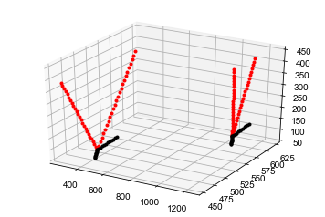
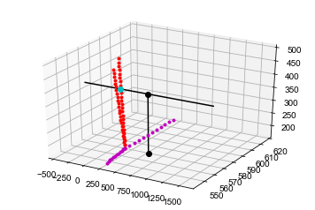
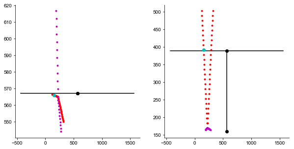
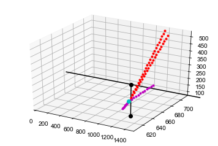
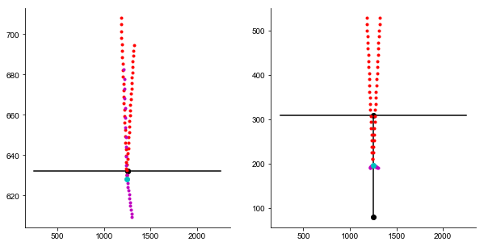
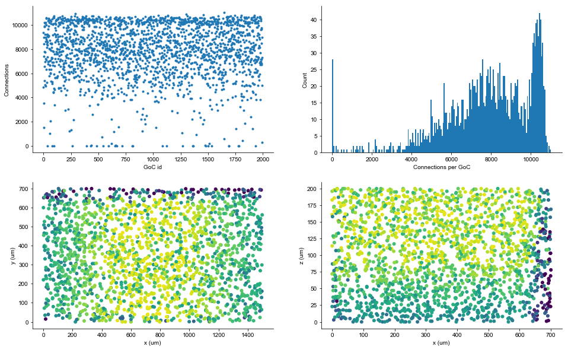
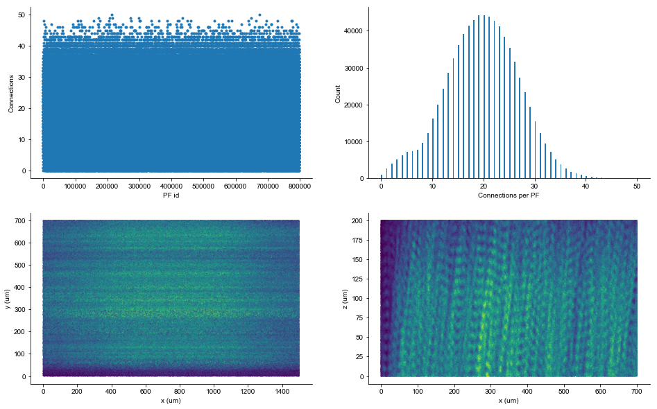
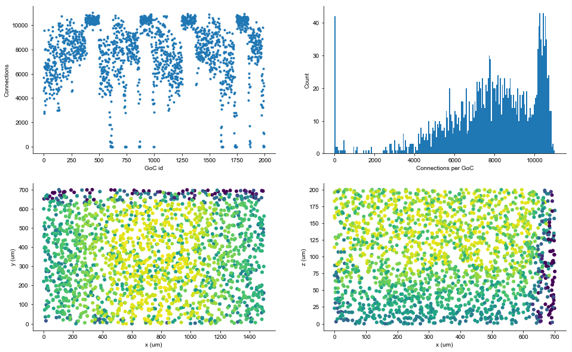
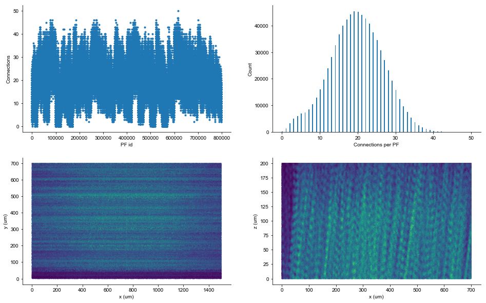

## Parallel fiber - GoC


```python
from pathlib import Path
import numpy as np
import matplotlib.pyplot as plt
from mpl_toolkits.mplot3d import Axes3D

```


```python
output_path = Path.cwd().parent.parent / 'output_2'
```


```python
adend = np.loadtxt(output_path / 'GoCadendcoordinates.dat')
bdend = np.loadtxt(output_path / 'GoCbdendcoordinates.dat')
grcs = np.loadtxt(output_path / "GCcoordinates.sorted.dat")
gcts = np.loadtxt(output_path / "GCTcoordinates.dat")
```


```python
adend = adend.reshape((1995,50,3))
bdend = bdend.reshape((1995,24,3))
```

Here we check if the dendritic point alignment is ok.


```python
%matplotlib inline
i = 1
fig = plt.figure()
ax = fig.add_subplot(111, projection='3d')
ax.plot(adend[i][:,0], adend[i][:,1], adend[i][:,2],'.r')
ax.plot(bdend[i][:,0], bdend[i][:,1], bdend[i][:,2],'.k')

i = 1000
ax.plot(adend[i][:,0], adend[i][:,1], adend[i][:,2],'.r')
ax.plot(bdend[i][:,0], bdend[i][:,1], bdend[i][:,2],'.k')
```


    [<mpl_toolkits.mplot3d.art3d.Line3D at 0x1266af3c8>]





Now we check if connections look ok.


```python
data_index = 10

data_dir = output_path
fcoords = "PFtoGoCcoords{}.dat".format(data_index)
fsrcs = "PFtoGoCsources{}.dat".format(data_index)
ftgts = "PFtoGoCtargets{}.dat".format(data_index)
fdsts = "PFtoGoCdistances{}.dat".format(data_index)


xyz = np.loadtxt(data_dir / fcoords)
srcs = np.loadtxt(data_dir / fsrcs).astype(int)
tgts = np.loadtxt(data_dir / ftgts).astype(int)
dsts = np.loadtxt(data_dir / fdsts)
```


```python
i = 4000
tgt = tgts[i]
src = srcs[i]
dst = dsts[i]

pt2 = xyz[i]

print("{} -> {} with d = {}".format(src, tgt, dst))
```

    564101 -> 166 with d = 642.660070951


```python
%matplotlib inline
fig = plt.figure()
ax = fig.add_subplot(111, projection='3d')
pt0 = grcs[src]
pt1 = gcts[src]
ax.plot([pt0[0], pt1[0]], [pt0[1], pt1[1]], [pt0[2], pt1[2]], 'o-k')
ax.plot([pt1[0], pt1[0]+1e3], [pt1[1], pt1[1]], [pt1[2], pt1[2]], '-k')
ax.plot([pt1[0], pt1[0]-1e3], [pt1[1], pt1[1]], [pt1[2], pt1[2]], '-k')
ax.plot(adend[tgt][:,0], adend[tgt][:,1], adend[tgt][:,2],'.r')
ax.plot(bdend[tgt][:,0], bdend[tgt][:,1], bdend[tgt][:,2],'.m')
pt2 = xyz[i]
ax.plot([pt2[0]], [pt2[1]], [pt2[2]], 'oc')
# ax.set_xlim([0, 1500])
```


    [<mpl_toolkits.mplot3d.art3d.Line3D at 0x1279ce5f8>]





```python
% matplotlib inline

fig, ax = plt.subplots(ncols=2, figsize=(10, 5), sharex=False)
ax[0].plot([pt0[0], pt1[0]], [pt0[1], pt1[1]], 'o-k')
ax[0].plot([pt1[0], pt1[0]+1e3], [pt1[1], pt1[1]], '-k')
ax[0].plot([pt1[0], pt1[0]-1e3], [pt1[1], pt1[1]], '-k')
ax[0].plot(adend[tgt][:,0], adend[tgt][:,1], '.r')
ax[0].plot(bdend[tgt][:,0], bdend[tgt][:,1], '.m')
ax[0].plot([pt2[0]], [pt2[1]], 'oc')


ax[1].plot([pt0[0], pt1[0]], [pt0[2], pt1[2]], 'o-k')
ax[1].plot([pt1[0], pt1[0]+1e3], [pt1[2], pt1[2]], '-k')
ax[1].plot([pt1[0], pt1[0]-1e3], [pt1[2], pt1[2]], '-k')
ax[1].plot(adend[tgt][:,0], adend[tgt][:,2],'.r')
ax[1].plot(bdend[tgt][:,0], bdend[tgt][:,2],'.m')
ax[1].plot([pt2[0]], [pt2[2]], 'oc')
```


    [<matplotlib.lines.Line2D at 0x116b1ff98>]





## Ascending axon - GoC


```python
data_index = 80

data_dir = output_path
fcoords = "AAtoGoCcoords{}.dat".format(data_index)
fsrcs = "AAtoGoCsources{}.dat".format(data_index)
ftgts = "AAtoGoCtargets{}.dat".format(data_index)
fdsts = "AAtoGoCdistances{}.dat".format(data_index)

xyz = np.loadtxt(data_dir / fcoords)
srcs = np.loadtxt(data_dir / fsrcs).astype(int)
tgts = np.loadtxt(data_dir / ftgts).astype(int)
dsts = np.loadtxt(data_dir / fdsts)
```


```python
i = 6900
tgt = tgts[i]
src = srcs[i]
dst = dsts[i]

pt2 = xyz[i]

print("{} -> {} with d = {}".format(src, tgt, dst))
```

    374693 -> 1330 with d = 117.454545455


```python
fig = plt.figure()
ax = fig.add_subplot(111, projection='3d')
pt0 = grcs[src]
pt1 = gcts[src]
ax.plot([pt0[0], pt1[0]], [pt0[1], pt1[1]], [pt0[2], pt1[2]], 'o-k')
ax.plot([pt1[0], pt1[0]+1e3], [pt1[1], pt1[1]], [pt1[2], pt1[2]], '-k')
ax.plot([pt1[0], pt1[0]-1e3], [pt1[1], pt1[1]], [pt1[2], pt1[2]], '-k')
ax.plot(adend[tgt][:,0], adend[tgt][:,1], adend[tgt][:,2],'.r')
ax.plot(bdend[tgt][:,0], bdend[tgt][:,1], bdend[tgt][:,2],'.m')
pt2 = xyz[i]
ax.plot([pt2[0]], [pt2[1]], [pt2[2]], 'oc')
ax.set_xlim([0, 1500])

```


    (0, 1500)





```python
% matplotlib inline

fig, ax = plt.subplots(ncols=2, figsize=(10, 5), sharex=True)
ax[0].plot([pt0[0], pt1[0]], [pt0[1], pt1[1]], 'o-k')
ax[0].plot([pt1[0], pt1[0]+1e3], [pt1[1], pt1[1]], '-k')
ax[0].plot([pt1[0], pt1[0]-1e3], [pt1[1], pt1[1]], '-k')
ax[0].plot(adend[tgt][:,0], adend[tgt][:,1], '.r')
ax[0].plot(bdend[tgt][:,0], bdend[tgt][:,1], '.m')
ax[0].plot([pt2[0]], [pt2[1]], 'oc')


ax[1].plot([pt0[0], pt1[0]], [pt0[2], pt1[2]], 'o-k')
ax[1].plot([pt1[0], pt1[0]+1e3], [pt1[2], pt1[2]], '-k')
ax[1].plot([pt1[0], pt1[0]-1e3], [pt1[2], pt1[2]], '-k')
ax[1].plot(adend[tgt][:,0], adend[tgt][:,2],'.r')
ax[1].plot(bdend[tgt][:,0], bdend[tgt][:,2],'.m')
ax[1].plot([pt2[0]], [pt2[2]], 'oc')
```


    [<matplotlib.lines.Line2D at 0x119f83828>]





## Convert big files to the npy format


```python
output_path = Path('/Users/shhong/Dropbox/network_data/output_ines_2')
# output_path = Path('/Users/shhong/Dropbox/network_data/output_brep')
src = np.loadtxt(output_path / "PFtoGoCsources.dat")
tgt = np.loadtxt(output_path / "PFtoGoCtargets.dat")
src = src.astype(int)
tgt = tgt.astype(int)

np.save(output_path / 'PFtoGoCsources.npy', src)
np.save(output_path / 'PFtoGoCtargets.npy', tgt)
```


```python
src = np.loadtxt(output_path / "AAtoGoCsources.dat")
tgt = np.loadtxt(output_path / "AAtoGoCtargets.dat")
src = src.astype(int)
tgt = tgt.astype(int)

np.save(output_path / 'AAtoGoCsources.npy', src)
np.save(output_path / 'AAtoGoCtargets.npy', tgt)
```

## Load back data and check PFs


```python
output_path = Path('/Users/shhong/Dropbox/network_data/output_ines_2')

srcs = np.load(output_path / 'PFtoGoCsources.npy')
tgts = np.load(output_path / 'PFtoGoCtargets.npy')

grcxy = np.loadtxt(output_path / 'GCcoordinates.sorted.dat')
gocxy = np.loadtxt(output_path / 'GoCcoordinates.sorted.dat')
```


```python
import dask.dataframe as dd

df = dd.from_array(np.vstack((srcs, tgts)).T, columns=('src', 'tgt'))
```


```python
cons_per_goc = df.groupby('tgt').count().compute()
cons_per_goc
cons_per_pf = df.groupby('src').count().compute()
cons_per_pf
```


<div>
<style scoped>
    .dataframe tbody tr th:only-of-type {
        vertical-align: middle;
    }

    .dataframe tbody tr th {
        vertical-align: top;
    }

    .dataframe thead th {
        text-align: right;
    }
</style>
<table border="1" class="dataframe">
  <thead>
    <tr style="text-align: right;">
      <th></th>
      <th>tgt</th>
    </tr>
    <tr>
      <th>src</th>
      <th></th>
    </tr>
  </thead>
  <tbody>
    <tr>
      <th>16</th>
      <td>18</td>
    </tr>
    <tr>
      <th>28</th>
      <td>17</td>
    </tr>
    <tr>
      <th>47</th>
      <td>31</td>
    </tr>
    <tr>
      <th>51</th>
      <td>19</td>
    </tr>
    <tr>
      <th>55</th>
      <td>9</td>
    </tr>
    <tr>
      <th>56</th>
      <td>13</td>
    </tr>
    <tr>
      <th>89</th>
      <td>23</td>
    </tr>
    <tr>
      <th>114</th>
      <td>12</td>
    </tr>
    <tr>
      <th>125</th>
      <td>23</td>
    </tr>
    <tr>
      <th>140</th>
      <td>3</td>
    </tr>
    <tr>
      <th>143</th>
      <td>11</td>
    </tr>
    <tr>
      <th>158</th>
      <td>30</td>
    </tr>
    <tr>
      <th>188</th>
      <td>11</td>
    </tr>
    <tr>
      <th>206</th>
      <td>24</td>
    </tr>
    <tr>
      <th>218</th>
      <td>32</td>
    </tr>
    <tr>
      <th>223</th>
      <td>20</td>
    </tr>
    <tr>
      <th>246</th>
      <td>1</td>
    </tr>
    <tr>
      <th>344</th>
      <td>22</td>
    </tr>
    <tr>
      <th>346</th>
      <td>21</td>
    </tr>
    <tr>
      <th>348</th>
      <td>16</td>
    </tr>
    <tr>
      <th>366</th>
      <td>17</td>
    </tr>
    <tr>
      <th>367</th>
      <td>30</td>
    </tr>
    <tr>
      <th>377</th>
      <td>31</td>
    </tr>
    <tr>
      <th>390</th>
      <td>9</td>
    </tr>
    <tr>
      <th>391</th>
      <td>32</td>
    </tr>
    <tr>
      <th>409</th>
      <td>33</td>
    </tr>
    <tr>
      <th>453</th>
      <td>7</td>
    </tr>
    <tr>
      <th>460</th>
      <td>18</td>
    </tr>
    <tr>
      <th>474</th>
      <td>32</td>
    </tr>
    <tr>
      <th>490</th>
      <td>26</td>
    </tr>
    <tr>
      <th>...</th>
      <td>...</td>
    </tr>
    <tr>
      <th>734230</th>
      <td>1</td>
    </tr>
    <tr>
      <th>737045</th>
      <td>1</td>
    </tr>
    <tr>
      <th>737676</th>
      <td>1</td>
    </tr>
    <tr>
      <th>740462</th>
      <td>1</td>
    </tr>
    <tr>
      <th>743307</th>
      <td>1</td>
    </tr>
    <tr>
      <th>743609</th>
      <td>1</td>
    </tr>
    <tr>
      <th>744736</th>
      <td>1</td>
    </tr>
    <tr>
      <th>745840</th>
      <td>1</td>
    </tr>
    <tr>
      <th>745856</th>
      <td>1</td>
    </tr>
    <tr>
      <th>746049</th>
      <td>1</td>
    </tr>
    <tr>
      <th>747549</th>
      <td>1</td>
    </tr>
    <tr>
      <th>750633</th>
      <td>1</td>
    </tr>
    <tr>
      <th>751627</th>
      <td>1</td>
    </tr>
    <tr>
      <th>751844</th>
      <td>1</td>
    </tr>
    <tr>
      <th>755346</th>
      <td>1</td>
    </tr>
    <tr>
      <th>755739</th>
      <td>1</td>
    </tr>
    <tr>
      <th>755814</th>
      <td>1</td>
    </tr>
    <tr>
      <th>756236</th>
      <td>1</td>
    </tr>
    <tr>
      <th>757768</th>
      <td>1</td>
    </tr>
    <tr>
      <th>758230</th>
      <td>1</td>
    </tr>
    <tr>
      <th>761769</th>
      <td>1</td>
    </tr>
    <tr>
      <th>762973</th>
      <td>1</td>
    </tr>
    <tr>
      <th>764795</th>
      <td>1</td>
    </tr>
    <tr>
      <th>771259</th>
      <td>1</td>
    </tr>
    <tr>
      <th>775488</th>
      <td>1</td>
    </tr>
    <tr>
      <th>776811</th>
      <td>1</td>
    </tr>
    <tr>
      <th>783282</th>
      <td>1</td>
    </tr>
    <tr>
      <th>784285</th>
      <td>1</td>
    </tr>
    <tr>
      <th>784570</th>
      <td>1</td>
    </tr>
    <tr>
      <th>789146</th>
      <td>1</td>
    </tr>
  </tbody>
</table>
<p>796922 rows × 1 columns</p>
</div>


```python
import dask.dataframe as dd

def convert_from_dd(x, size):
    temp = np.zeros(size)
    temp[x.index] = x.values
    return temp

cons_per_goc = convert_from_dd(cons_per_goc.src, gocxy.shape[0])
cons_per_pf = convert_from_dd(cons_per_pf.tgt, grcxy.shape[0])
```


```python
fig, ax = plt.subplots(ncols=2, nrows=2, figsize=(16, 10))
ax[0,0].plot(cons_per_goc, '.')
ax[0,0].set(xlabel="GoC id", ylabel='Connections')
_ = ax[0,1].hist(cons_per_goc, 200)
ax[0,1].set(xlabel="Connections per GoC", ylabel='Count')
ax[1,0].scatter(gocxy[:,0], gocxy[:,1], 100, cons_per_goc, '.')
ax[1,0].set(xlabel="x (um)", ylabel="y (um)")
ax[1,1].scatter(gocxy[:,1], gocxy[:,2], 100, cons_per_goc, '.')
ax[1,1].set(xlabel="x (um)", ylabel="z (um)")
```


    [Text(0,0.5,'z (um)'), Text(0.5,0,'x (um)')]





```python
print("Connections per GoC = {} ± {}".format(np.mean(cons_per_goc), np.std(cons_per_goc)/np.sqrt(cons_per_goc.size)))
```

    Connections per GoC = 7845.491228070176 ± 50.341722506957936


```python
fig, ax = plt.subplots(ncols=2, nrows=2, figsize=(16, 10))
ax[0,0].plot(cons_per_pf, '.')
ax[0,0].set(xlabel="PF id", ylabel='Connections')
ax[0,1].set(xlabel="Connections per PF", ylabel='Count')
_ = ax[0,1].hist(cons_per_pf, 200)
ax[1,0].scatter(grcxy[:,0], grcxy[:,1], 0.25, cons_per_pf, '.')
ax[1,0].set(xlabel="x (um)", ylabel="y (um)")
ax[1,1].scatter(grcxy[:,1], grcxy[:,2], 0.25, cons_per_pf, '.')
ax[1,1].set(xlabel="x (um)", ylabel="z (um)")
```


    [Text(0,0.5,'z (um)'), Text(0.5,0,'x (um)')]





```python
print("Connections per PF = {} ± {}".format(np.mean(cons_per_pf), np.std(cons_per_pf)/np.sqrt(cons_per_pf.size)))
```

    Connections per PF = 19.613728070175437 ± 0.007967805495340553


## Perform the same analysis on BREP outputs


```python
# output_path = Path('/Users/shhong/Dropbox/network_data/output_brep')
# src = np.loadtxt(output_path / "PFtoGoCsources.dat")
# tgt = np.loadtxt(output_path / "PFtoGoCtargets.dat")
# src = src.astype(int)
# tgt = tgt.astype(int)

# np.save(output_path / 'PFtoGoCsources.npy', src)
# np.save(output_path / 'PFtoGoCtargets.npy', tgt)

# src = np.loadtxt(output_path / "AAtoGoCsources.dat")
# tgt = np.loadtxt(output_path / "AAtoGoCtargets.dat")
# src = src.astype(int)
# tgt = tgt.astype(int)

# np.save(output_path / 'AAtoGoCsources.npy', src)
# np.save(output_path / 'AAtoGoCtargets.npy', tgt)
```


```python
output_path = Path('/Users/shhong/Dropbox/network_data/output_brep')

srcs = np.load(output_path / 'PFtoGoCsources.npy')
tgts = np.load(output_path / 'PFtoGoCtargets.npy')
grcxy = np.loadtxt(output_path / 'GCcoordinates.sorted.dat')
gocxy = np.loadtxt(output_path / 'GoCcoordinates.sorted.dat')

df = dd.from_array(np.vstack((srcs, tgts)).T, columns=('src', 'tgt'))
```


```python
cons_per_goc = df.groupby('tgt').count().compute()
cons_per_pf = df.groupby('src').count().compute()

cons_per_goc = convert_from_dd(cons_per_goc.src, gocxy.shape[0])
cons_per_pf = convert_from_dd(cons_per_pf.tgt, grcxy.shape[0])
```


```python
fig, ax = plt.subplots(ncols=2, nrows=2, figsize=(16, 10))
ax[0,0].plot(cons_per_goc, '.')
ax[0,0].set(xlabel="GoC id", ylabel='Connections')
_ = ax[0,1].hist(cons_per_goc, 200)
ax[0,1].set(xlabel="Connections per GoC", ylabel='Count')
ax[1,0].scatter(gocxy[:,0], gocxy[:,1], 100, cons_per_goc, '.')
ax[1,0].set(xlabel="x (um)", ylabel="y (um)")
ax[1,1].scatter(gocxy[:,1], gocxy[:,2], 100, cons_per_goc, '.')
ax[1,1].set(xlabel="x (um)", ylabel="z (um)")
```


    [Text(0,0.5,'z (um)'), Text(0.5,0,'x (um)')]





```python
print("Connections per GoC = {} ± {}".format(np.mean(cons_per_goc), np.std(cons_per_goc)/np.sqrt(cons_per_goc.size)))
```

    Connections per GoC = 7840.988471177945 ± 52.70376589807917


```python
fig, ax = plt.subplots(ncols=2, nrows=2, figsize=(16, 10))
ax[0,0].plot(cons_per_pf, '.')
ax[0,0].set(xlabel="PF id", ylabel='Connections')
ax[0,1].set(xlabel="Connections per PF", ylabel='Count')
_ = ax[0,1].hist(cons_per_pf, 200)
ax[1,0].scatter(grcxy[:,0], grcxy[:,1], 0.25, cons_per_pf, '.')
ax[1,0].set(xlabel="x (um)", ylabel="y (um)")
ax[1,1].scatter(grcxy[:,1], grcxy[:,2], 0.25, cons_per_pf, '.')
ax[1,1].set(xlabel="x (um)", ylabel="z (um)")
```


    [Text(0,0.5,'z (um)'), Text(0.5,0,'x (um)')]





```python
print("Connections per PF = {} ± {}".format(np.mean(cons_per_pf), np.std(cons_per_pf)/np.sqrt(cons_per_pf.size)))
```

    Connections per PF = 19.602471177944864 ± 0.007836733126837756


```python
9708.829573934838/7840.988471177945
```


    1.2382150043483342


```python
24.272073934837092/19.602471177944864
```


    1.238215004348334


```python
np.sqrt(1.238215004)
```


    1.1127510970563004


