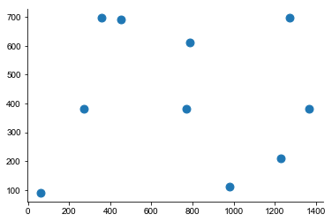
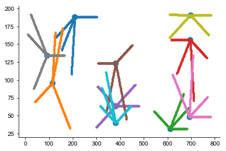
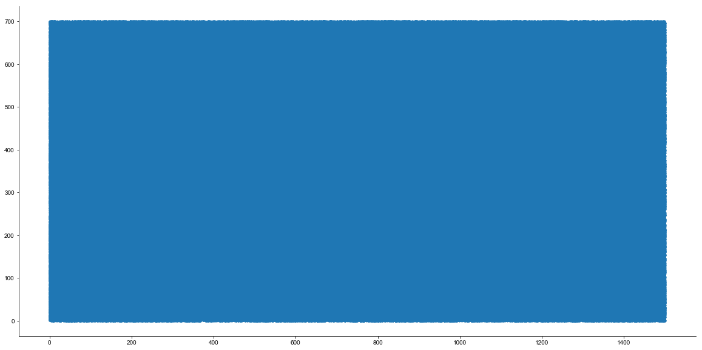
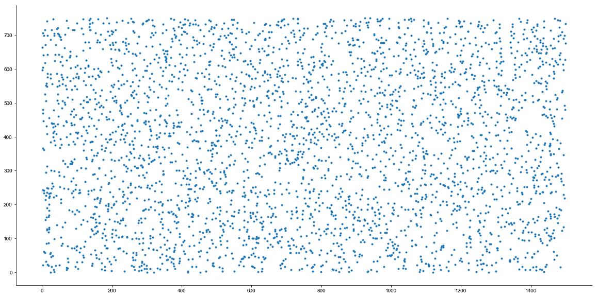
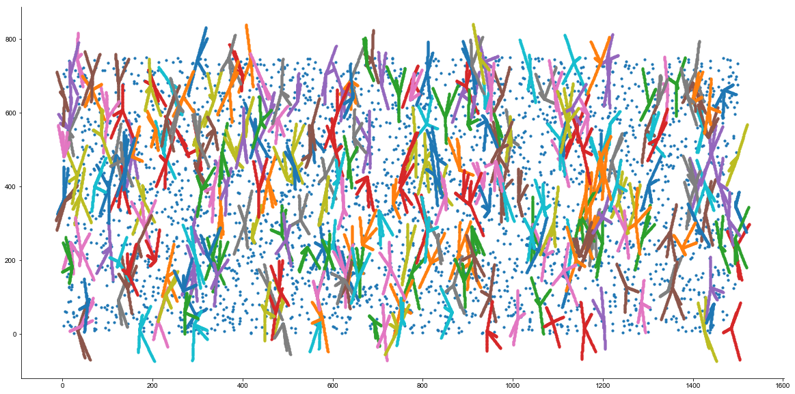
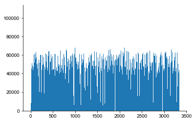

```python

```

    /Users/shhong/Documents/Ines/pybrep


```python
import pybrep.cell_population as cell_pop
```


```python
import numpy as np

```


```python
xyz = np.random.rand(10,3)
xyz[:,0] = xyz[:,0]*1500
xyz[:,1] = xyz[:,1]*750
xyz[:,2] = xyz[:,2]*200

```


```python
import matplotlib.pyplot as plt
%matplotlib ipympl
```


```python
plt.scatter(xyz[:,0], xyz[:,1], 80)
```


    <matplotlib.collections.PathCollection at 0x112ed1fd0>





```python
mlis = cell_pop.MLI_pop([])
mlis.load_somata(xyz)
```


```python
mlis.add_dendrites()
```


```python
idx = mlis.qpts.idx
for i in np.unique(idx):
    ii = (i==idx)
    xyz1 = mlis.qpts.coo[ii,:]
    plt.plot(xyz1[:,1], xyz1[:,2], '.')
plt.scatter(xyz[:,1], xyz[:,2], 80)
```


    <matplotlib.collections.PathCollection at 0x113639b70>





```python
cd ..
```

    /Users/shhong/Documents/Ines/pybrep


```python
import pybrep as brp
import numpy as np
from neuron import h

```


```python
h.xopen("/Users/shhong/Dropbox/network_data/model/params/set3005/Parameters.hoc")
gp = brp.create_population('Granule', h)

```

    Nseg for APical is 5 and Basal is 3
    	36 


```python
gp.load_somata('/Users/shhong/Dropbox/network_data/input_brep_2/GCcoordinates.dat')
gp.add_aa_endpoints_fixed()
gp.add_pf_endpoints()

```

    Successfully read /Users/shhong/Dropbox/network_data/input_brep_2/GCcoordinates.dat.


```python
import matplotlib.pyplot as plt
%matplotlib inline

_, ax = plt.subplots(figsize=(20,10))
ax.plot(gp.som[:,0], gp.som[:,1], '.')
```


    [<matplotlib.lines.Line2D at 0x113471da0>]





```python
n_mli = 21735 # rat
n_mli = 22275 # human
n_mli = 33413
n_mli = int(33413/10) # test only with 10%
```


```python
xyz = np.random.rand(n_mli, 3)
xyz[:,0] = xyz[:,0]*1500
xyz[:,1] = xyz[:,1]*750
xyz[:,2] = xyz[:,2]*200

```


```python
_, ax = plt.subplots(figsize=(20,10))
ax.plot(xyz[:,0], xyz[:,1], '.')
```


    [<matplotlib.lines.Line2D at 0x11676a400>]





```python
mlip = brp.create_population('MLI', h)

```


```python
mlip.load_somata(xyz)
```


```python
mlip.add_dendrites()
mlip.qpts.coo[:,2] = mlip.qpts.coo[:,2] + h.GLdepth + h.PCLdepth
```

    100%|██████████| 3341/3341 [07:28<00:00,  3.71it/s]


```python
mlip.qpts.idx
```


    array([   0.,    0.,    0., ..., 3340., 3340., 3340.])


```python
_, ax = plt.subplots(figsize=(20,10))
idx = mlip.qpts.idx
for i in range(300):
    ii = (i==idx)
    xyz1 = mlip.qpts.coo[ii,:]
    ax.plot(xyz1[:,0], xyz1[:,1], '.')
ax.scatter(xyz[:,0], xyz[:,1], 10)
```


    <matplotlib.collections.PathCollection at 0x1a1fda3898>





```python
c_rad_aa = h.AAtoGoCzone/1.73
```


```python
cc = brp.Connect_2D(gp.qpts_aa, mlip.qpts, c_rad_aa)
```


```python
cc.connections_parallel(deparallelize=True, nblocks=120, debug=True)
```

    Blocks =  120


    
    
      0%|          | 0/120 [00:00<?, ?it/s]
    
      1%|          | 1/120 [00:19<39:13, 19.78s/it]
    
      2%|▏         | 2/120 [00:40<39:32, 20.10s/it]
    
      2%|▎         | 3/120 [01:01<39:40, 20.34s/it]


    ---------------------------------------------------------------------------

    KeyboardInterrupt                         Traceback (most recent call last)

    <ipython-input-53-e51e32fc6698> in <module>
    ----> 1 cc.connections_parallel(deparallelize=True, nblocks=120, debug=True)
    

    ~/Documents/Ines/pybrep/pybrep/connector.py in connections_parallel(self, deparallelize, serial_fallback, req_lin_in_tree, nblocks, run_only, debug)
        194             s = []
        195             for id1 in tqdm(id_ar):
    --> 196                 s.append(lam_qpt(id1))
        197 
        198         self.result = pd.concat(s, ignore_index=True)


    ~/Documents/Ines/pybrep/pybrep/connector.py in <lambda>(ids)
        174         lin_is_src = self.lin_is_src
        175 
    --> 176         lam_qpt = lambda ids: parallel_util.find_connections_2dpar(kdt, pts, lpts, c_rad, lin_axis, lin_in_tree, lin_is_src, ids, debug)
        177 
        178         # split data into nblocks blocks


    ~/Documents/Ines/pybrep/pybrep/parallel_util.py in find_connections_2dpar(kdt, pts, lpts, c_rad, lin_axis, lin_in_tree, lin_is_src, ids, debug)
         49         #check if the found points match along the linearized axis and if so, add distance from the beginning of the linearized axis
         50         if lin_in_tree:
    ---> 51             ind = ind[numpy.logical_and(lax_range[ind,0]<=lax_c[i], lax_range[ind,1]>= lax_c[i])]
         52             res_l.append(abs(lax_c[i] - lax_range[ind,0] -lpts.set_0[ind]) + lpts.lin_offset[ind])
         53         else:


    KeyboardInterrupt: 


```python
c_rad_pf = h.PFtoGoCzone/1.113
cc = brp.Connect_2D(gp.qpts_pf, mlip.qpts, c_rad_pf)
cc.connections_parallel(deparallelize=True, nblocks=120, debug=True)
```

    Blocks =  120


    
    
    
      0%|          | 0/120 [00:00<?, ?it/s]
    
    
      1%|          | 1/120 [00:20<40:32, 20.44s/it]
    
    
      2%|▏         | 2/120 [00:42<40:59, 20.84s/it]
    
    
      2%|▎         | 3/120 [01:03<41:02, 21.05s/it]
    
    
      3%|▎         | 4/120 [01:24<40:34, 20.99s/it]
    
    
      4%|▍         | 5/120 [01:45<40:08, 20.94s/it]
    
    
      5%|▌         | 6/120 [02:06<39:46, 20.93s/it]
    
    
      6%|▌         | 7/120 [02:27<39:22, 20.91s/it]
    
    
      7%|▋         | 8/120 [02:48<39:30, 21.16s/it]
    
    
      8%|▊         | 9/120 [03:10<39:20, 21.26s/it]
    
    
      8%|▊         | 10/120 [03:30<38:15, 20.86s/it]
    
    
      9%|▉         | 11/120 [03:50<37:25, 20.60s/it]
    
    
     10%|█         | 12/120 [04:10<36:58, 20.54s/it]
    
    
     11%|█         | 13/120 [04:31<36:36, 20.53s/it]
    
    
     12%|█▏        | 14/120 [04:50<35:36, 20.15s/it]
    
    
     12%|█▎        | 15/120 [05:10<35:09, 20.09s/it]
    
    
     13%|█▎        | 16/120 [05:32<35:38, 20.56s/it]
    
    
     14%|█▍        | 17/120 [05:54<36:07, 21.04s/it]
    
    
     15%|█▌        | 18/120 [06:15<35:40, 20.98s/it]
    
    
     16%|█▌        | 19/120 [06:36<35:21, 21.01s/it]
    
    
     17%|█▋        | 20/120 [06:57<35:02, 21.02s/it]
    
    
     18%|█▊        | 21/120 [07:16<33:37, 20.38s/it]
    
    
     18%|█▊        | 22/120 [07:35<32:44, 20.04s/it]
    
    
     19%|█▉        | 23/120 [07:54<31:59, 19.79s/it]
    
    
     20%|██        | 24/120 [08:15<32:07, 20.07s/it]
    
    
     21%|██        | 25/120 [08:36<32:17, 20.40s/it]
    
    
     22%|██▏       | 26/120 [08:57<32:09, 20.53s/it]
    
    
     22%|██▎       | 27/120 [09:18<32:16, 20.82s/it]
    
    
     23%|██▎       | 28/120 [09:38<31:25, 20.50s/it]
    
    
     24%|██▍       | 29/120 [10:00<31:40, 20.88s/it]
    
    
     25%|██▌       | 30/120 [10:20<31:06, 20.73s/it]
    
    
     26%|██▌       | 31/120 [10:41<30:55, 20.85s/it]
    
    
     27%|██▋       | 32/120 [11:02<30:38, 20.89s/it]
    
    
     28%|██▊       | 33/120 [11:23<30:07, 20.77s/it]
    
    
     28%|██▊       | 34/120 [11:43<29:30, 20.59s/it]
    
    
     29%|██▉       | 35/120 [12:02<28:18, 19.98s/it]
    
    
     30%|███       | 36/120 [12:23<28:30, 20.36s/it]
    
    
     31%|███       | 37/120 [12:43<28:17, 20.45s/it]
    
    
     32%|███▏      | 38/120 [13:04<28:03, 20.53s/it]
    
    
     32%|███▎      | 39/120 [13:26<28:07, 20.83s/it]
    
    
     33%|███▎      | 40/120 [13:46<27:39, 20.75s/it]
    
    
     34%|███▍      | 41/120 [14:07<27:17, 20.72s/it]
    
    
     35%|███▌      | 42/120 [14:27<26:30, 20.39s/it]
    
    
     36%|███▌      | 43/120 [14:46<25:38, 19.98s/it]
    
    
     37%|███▋      | 44/120 [15:05<25:08, 19.85s/it]
    
    
     38%|███▊      | 45/120 [15:26<25:14, 20.19s/it]
    
    
     38%|███▊      | 46/120 [15:48<25:27, 20.65s/it]
    
    
     39%|███▉      | 47/120 [16:09<25:19, 20.82s/it]
    
    
     40%|████      | 48/120 [16:29<24:32, 20.45s/it]
    
    
     41%|████      | 49/120 [16:47<23:36, 19.95s/it]
    
    
     42%|████▏     | 50/120 [17:09<23:43, 20.33s/it]
    
    
     42%|████▎     | 51/120 [17:28<22:53, 19.90s/it]
    
    
     43%|████▎     | 52/120 [17:48<22:46, 20.10s/it]
    
    
     44%|████▍     | 53/120 [18:10<22:55, 20.53s/it]
    
    
     45%|████▌     | 54/120 [18:32<23:02, 20.95s/it]
    
    
     46%|████▌     | 55/120 [18:51<22:12, 20.50s/it]
    
    
     47%|████▋     | 56/120 [19:12<22:10, 20.78s/it]
    
    
     48%|████▊     | 57/120 [19:31<21:13, 20.22s/it]
    
    
     48%|████▊     | 58/120 [19:50<20:30, 19.84s/it]
    
    
     49%|████▉     | 59/120 [20:10<20:02, 19.71s/it]
    
    
     50%|█████     | 60/120 [20:30<19:54, 19.91s/it]
    
    
     51%|█████     | 61/120 [20:50<19:36, 19.94s/it]
    
    
     52%|█████▏    | 62/120 [21:11<19:28, 20.15s/it]
    
    
     52%|█████▎    | 63/120 [21:32<19:24, 20.43s/it]
    
    
     53%|█████▎    | 64/120 [21:53<19:11, 20.56s/it]
    
    
     54%|█████▍    | 65/120 [22:13<18:39, 20.35s/it]
    
    
     55%|█████▌    | 66/120 [22:34<18:29, 20.55s/it]
    
    
     56%|█████▌    | 67/120 [22:54<18:08, 20.54s/it]
    
    
     57%|█████▋    | 68/120 [23:12<17:09, 19.80s/it]
    
    
     57%|█████▊    | 69/120 [23:31<16:33, 19.48s/it]
    
    
     58%|█████▊    | 70/120 [23:52<16:35, 19.92s/it]
    
    
     59%|█████▉    | 71/120 [24:14<16:46, 20.54s/it]
    
    
     60%|██████    | 72/120 [24:34<16:27, 20.57s/it]
    
    
     61%|██████    | 73/120 [24:55<16:05, 20.55s/it]
    
    
     62%|██████▏   | 74/120 [25:15<15:42, 20.49s/it]
    
    
     62%|██████▎   | 75/120 [25:38<15:49, 21.10s/it]
    
    
     63%|██████▎   | 76/120 [25:59<15:35, 21.26s/it]
    
    
     64%|██████▍   | 77/120 [26:21<15:18, 21.36s/it]
    
    
     65%|██████▌   | 78/120 [26:42<14:54, 21.29s/it]
    
    
     66%|██████▌   | 79/120 [27:03<14:33, 21.29s/it]
    
    
     67%|██████▋   | 80/120 [27:25<14:12, 21.31s/it]
    
    
     68%|██████▊   | 81/120 [27:46<13:47, 21.22s/it]
    
    
     68%|██████▊   | 82/120 [28:06<13:13, 20.89s/it]
    
    
     69%|██████▉   | 83/120 [28:26<12:44, 20.66s/it]
    
    
     70%|███████   | 84/120 [28:46<12:17, 20.49s/it]
    
    
     71%|███████   | 85/120 [29:06<11:53, 20.37s/it]
    
    
     72%|███████▏  | 86/120 [29:27<11:34, 20.43s/it]
    
    
     72%|███████▎  | 87/120 [29:46<10:59, 19.99s/it]
    
    
     73%|███████▎  | 88/120 [30:07<10:47, 20.23s/it]
    
    
     74%|███████▍  | 89/120 [30:28<10:36, 20.52s/it]
    
    
     75%|███████▌  | 90/120 [30:50<10:32, 21.08s/it]
    
    
     76%|███████▌  | 91/120 [31:12<10:20, 21.38s/it]
    
    
     77%|███████▋  | 92/120 [31:33<09:49, 21.07s/it]
    
    
     78%|███████▊  | 93/120 [31:53<09:23, 20.88s/it]
    
    
     78%|███████▊  | 94/120 [32:14<09:02, 20.87s/it]
    
    
     79%|███████▉  | 95/120 [32:36<08:50, 21.22s/it]
    
    
     80%|████████  | 96/120 [32:57<08:30, 21.28s/it]
    
    
     81%|████████  | 97/120 [33:19<08:09, 21.29s/it]
    
    
     82%|████████▏ | 98/120 [33:39<07:43, 21.07s/it]
    
    
     82%|████████▎ | 99/120 [34:00<07:20, 20.96s/it]
    
    
     83%|████████▎ | 100/120 [34:21<06:57, 20.87s/it]
    
    
     84%|████████▍ | 101/120 [34:42<06:37, 20.94s/it]
    
    
     85%|████████▌ | 102/120 [35:02<06:16, 20.90s/it]
    
    
     86%|████████▌ | 103/120 [35:24<05:59, 21.13s/it]
    
    
     87%|████████▋ | 104/120 [35:45<05:36, 21.05s/it]
    
    
     88%|████████▊ | 105/120 [36:05<05:13, 20.88s/it]
    
    
     88%|████████▊ | 106/120 [36:27<04:55, 21.07s/it]
    
    
     89%|████████▉ | 107/120 [36:48<04:33, 21.03s/it]
    
    
     90%|█████████ | 108/120 [37:10<04:16, 21.35s/it]
    
    
     91%|█████████ | 109/120 [37:31<03:53, 21.20s/it]
    
    
     92%|█████████▏| 110/120 [37:52<03:30, 21.07s/it]
    
    
     92%|█████████▎| 111/120 [38:12<03:08, 20.95s/it]
    
    
     93%|█████████▎| 112/120 [38:34<02:48, 21.11s/it]
    
    
     94%|█████████▍| 113/120 [38:55<02:27, 21.10s/it]
    
    
     95%|█████████▌| 114/120 [39:14<02:02, 20.47s/it]
    
    
     96%|█████████▌| 115/120 [39:37<01:46, 21.22s/it]
    
    
     97%|█████████▋| 116/120 [39:57<01:24, 21.03s/it]
    
    
     98%|█████████▊| 117/120 [40:20<01:04, 21.50s/it]
    
    
     98%|█████████▊| 118/120 [40:41<00:42, 21.47s/it]
    
    
     99%|█████████▉| 119/120 [41:02<00:21, 21.21s/it]
    
    
    100%|██████████| 120/120 [41:22<00:00, 20.97s/it]
    
    
    


```python
gp.qpts_pf.coo[2][:,2][0]
```


    351.0


```python
cc.save_result('PFtoMLI')
```

    /Users/shhong/Documents/Ines/pybrep/pybrep/connector.py:265: UserWarning: Pre-existing table connection will be destroyed.
      warnings.warn('Pre-existing table ' + table_name + ' will be destroyed.')


    Begin writing the results.


    ---------------------------------------------------------------------------

    KeyboardInterrupt                         Traceback (most recent call last)

    <ipython-input-55-62a66c7da4df> in <module>
    ----> 1 cc.save_result('PFtoMLI')
    

    ~/Documents/Ines/pybrep/pybrep/connector.py in save_result(self, prefix, table_name, save_mode)
        272             foutname = prefix+'.db'
        273             conn = sqlite3.connect(foutname)
    --> 274             self.result.to_sql(table_name, conn, if_exists='append', index=False)
        275             conn.close()
        276 


    /opt/anaconda3/lib/python3.6/site-packages/pandas/core/generic.py in to_sql(self, name, con, schema, if_exists, index, index_label, chunksize, dtype)
       2128         sql.to_sql(self, name, con, schema=schema, if_exists=if_exists,
       2129                    index=index, index_label=index_label, chunksize=chunksize,
    -> 2130                    dtype=dtype)
       2131 
       2132     def to_pickle(self, path, compression='infer',


    /opt/anaconda3/lib/python3.6/site-packages/pandas/io/sql.py in to_sql(frame, name, con, schema, if_exists, index, index_label, chunksize, dtype)
        448     pandas_sql.to_sql(frame, name, if_exists=if_exists, index=index,
        449                       index_label=index_label, schema=schema,
    --> 450                       chunksize=chunksize, dtype=dtype)
        451 
        452 


    /opt/anaconda3/lib/python3.6/site-packages/pandas/io/sql.py in to_sql(self, frame, name, if_exists, index, index_label, schema, chunksize, dtype)
       1479                             dtype=dtype)
       1480         table.create()
    -> 1481         table.insert(chunksize)
       1482 
       1483     def has_table(self, name, schema=None):


    /opt/anaconda3/lib/python3.6/site-packages/pandas/io/sql.py in insert(self, chunksize)
        617 
        618     def insert(self, chunksize=None):
    --> 619         keys, data_list = self.insert_data()
        620 
        621         nrows = len(self.frame)


    /opt/anaconda3/lib/python3.6/site-packages/pandas/io/sql.py in insert_data(self)
        600                 d = b.values.astype('M8[us]').astype(object)
        601             else:
    --> 602                 d = np.array(b.get_values(), dtype=object)
        603 
        604             # replace NaN with None


    KeyboardInterrupt: 


```python
mlip.qpts.coo
```


    array([[   2.9659673 ,  366.31367359,  373.81661941],
           [   3.17498493,  368.30272151,  373.81661941],
           [   3.38400257,  370.29176943,  373.81661941],
           ...,
           [1369.57069461,  248.62121872,  326.80561901],
           [1369.77971224,  249.61404072,  325.08207147],
           [1369.98872987,  250.60686272,  323.35852394]])


```python
cc.result.shape[0]/10**6
```


    165.916999


```python
tgt = cc.result['target'].values
```


```python
z = plt.hist(tgt, range(3341))
```





```python
z[0].mean()
```


    49675.74820359281


```python
from tqdm import tqdm
```


```python
for i, x in tqdm(enumerate(['a', 'b', 'c'])):
    print(i, x)
```

    
    
    
    0it [00:00, ?it/s]
    
    
    3it [00:00, 2462.89it/s]

    0 a
    1 b
    2 c

