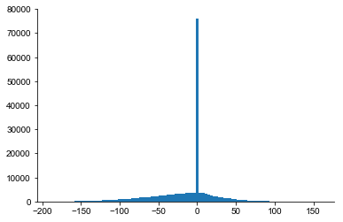

```python
import numpy as np
import matplotlib.pyplot as plt

from pathlib import Path
```


```python
root = Path('/Users/shhong/Dropbox/network_data/output_brep_2')
```


```python
root
```


    PosixPath('/Users/shhong/Dropbox/network_data/output_brep_2')


```python
xyz = np.loadtxt(root / "GoCcoordinates.sorted.dat")
dist0 = np.loadtxt(root / "GoCtoGoCdistances.dat")
```


```python
src = np.loadtxt(root / "GoCtoGoCsources.dat").astype(int)
tgt = np.loadtxt(root / "GoCtoGoCtargets.dat").astype(int)
```


```python
axon0 = np.loadtxt(root / "GoCaxoncoordinates.sorted.dat")
```


```python
axon0.shape
npoints = int(axon0.shape[1]/3)
```


```python
# axon = [np.vstack([x[:3], x.reshape(npoints, 3)[1::2]]) for x in axon0]
axon = [x.reshape(npoints, 3)[1::2] for x in axon0]
axon[0]
```


    array([[ 219. ,  -10.5,   23. ],
           [ 187. ,  104.5,   -4. ],
           [ 244. ,  102.5,  -50. ],
           [ 194. ,   69.5,   71. ],
           [ 246. ,   -1.5,   32. ],
           [ 220. ,  -69.5,  -24. ],
           [ 205. ,  -76.5,  -22. ],
           [ 211. ,    6.5,  -51. ],
           [ 261. ,  117.5,   67. ],
           [ 242. ,  143.5,   96. ],
           [ 181. ,   10.5,   62. ],
           [ 202. ,   62.5,  -23. ],
           [ 251. ,  -20.5,   43. ],
           [ 199. ,   57.5,    5. ],
           [ 193. , -107.5,   14. ],
           [ 258. ,   94.5,   -4. ],
           [ 174. ,   61.5,   45. ],
           [ 210. , -161.5,   34. ],
           [ 194. ,  116.5,   68. ],
           [ 240. ,  125.5,   33. ]])


```python
from tqdm import tqdm_notebook
colx = {}
for i in tqdm_notebook(range(ncell)):
    for j in range(ncell):
        if i!=j:
#         i = 1759
#         j = 1936
            di, ii = cKDTree(axon[i]).query(xyz[j])
            axon_len = np.sqrt(np.sum((axon[i][ii]-xyz[i])**2))
#             print(di, axon_len, axon_len+di)
            if di<100:
                colx[(i, j)] = axon_len + di
            
```


    HBox(children=(IntProgress(value=0, max=1995), HTML(value='')))


```python
il, = np.where(np.logical_and(src==i, tgt==j))
il
```


    array([42039])


```python
dist0[il]
```


    array([282.05695718])


```python
axon[[1,2]]
```


    ---------------------------------------------------------------------------

    TypeError                                 Traceback (most recent call last)

    <ipython-input-88-87025d381535> in <module>
    ----> 1 axon[[1,2]]
    

    TypeError: list indices must be integers or slices, not list


```python
ncell = 1995
ncoords = int(axon.shape[0]/ncell)
```


```python
cellind!=0
```


    array([False, False, False, ...,  True,  True,  True])


```python
cellind.shape
```


    (79800,)


```python
axon.shape
```


    (79800, 3)


```python
xyz[0]
```


    array([219.,   0.,  23.])


```python
cellind[cellind!=i][1173]
```


    30


```python
len(colx.keys())
```


    256440


```python
src.size
```


    184684


```python
i = 0
s, t = src[i], tgt[i]
print(s, t)
print(colx[(s, t)])
print(dist0[i])
```

    1921 1920
    53.86294886692424
    98.2372633010221


```python
colx[(t, s)]
```


    143.14873147064438


```python
s, t
di, ii = cKDTree(axon[s]).query(xyz[t])
axon_len = np.sqrt(np.sum((axon[s][ii]-xyz[s])**2))
print(s, t, di, axon_len)
```

    1921 1920 34.07345007480164 0.0


```python
dd[np.logical_and(dd[:,0]==s, dd[:,1]==t),2]
```


    array([122.95527642])


```python
dd = np.array([colx[(src[i], tgt[i])]-dist0[i] for i, _ in enumerate(src) if (src[i], tgt[i]) in colx.keys()])
```


```python
_ = plt.hist(dd,100)
```





```python
plt.plot(np.sort(dd),'.')
```


    [<matplotlib.lines.Line2D at 0x631325cc0>]


# ??


```python
xyz[t]
```


    array([1350.,  511.,  108.])


```python
dd = np.loadtxt(root / "GoCdistances0.dat")
```


```python
plt.plot(dd)
```


    ---------------------------------------------------------------------------

    NameError                                 Traceback (most recent call last)

    <ipython-input-238-e0f851c5a5c0> in <module>
    ----> 1 plot(dd)
    

    NameError: name 'plot' is not defined


```python
len(colx.keys())
```


    256263


```python
xyz = np.loadtxt(root / "GoCcoordinates.sorted.dat")
```


```python
from neuron import h
```


```python
h.load_file('/Users/shhong/Documents/cerebellar_cortex/Molecular_Layer/params/set3005/Parameters.hoc')
```

    Nseg for APical is 5 and Basal is 3
    	36 


    1.0


```python
width = []
minp = []
for k in ['X', 'Y', 'Z']:
    amin = eval("h.GoC_Axon_{}min".format(k))
    amax = eval("h.GoC_Axon_{}max".format(k))
    width.append(amax-amin)
    minp.append(amin)
width, minp = np.array(width), np.array(minp)
```

    -45.0 45.0
    -162.5 162.5
    -75.0 75.0
    [90.0, 325.0, 150.0] [-45.0, -162.5, -75.0]


```python
axon_coord = np.random.rand(ncell*20,3)
axon_coord = axon_coord*width + minp
```


```python
naxon = int(h.numAxonGolgi)
axon_base = np.zeros_like(axon_coord)
for i in range(ncell):
    axon_coord[(naxon*i):(naxon*(i+1))] = axon_coord[(naxon*i):(naxon*(i+1))] + xyz[i]
    axon_base[(naxon*i):(naxon*(i+1))] = xyz[i]
axon_coord
```


    array([[ 217.26670265,  -63.87375058,   69.23258076],
           [ 219.22142032,  143.46846988,   47.80986379],
           [ 177.21250012,   14.83625529,   13.75934021],
           ...,
           [1152.18412529,  792.02046545,   65.70798586],
           [1189.56691711,  665.18707163,   67.69751356],
           [1180.18460866,  551.65109259,  164.01319551]])


```python
axon_coord_file = np.hstack([axon_base, axon_coord])
axon_coord_file
```


    array([[ 219.        ,    0.        ,   23.        ,  217.26670265,
             -63.87375058,   69.23258076],
           [ 219.        ,    0.        ,   23.        ,  219.22142032,
             143.46846988,   47.80986379],
           [ 219.        ,    0.        ,   23.        ,  177.21250012,
              14.83625529,   13.75934021],
           ...,
           [1180.        ,  697.        ,  135.        , 1152.18412529,
             792.02046545,   65.70798586],
           [1180.        ,  697.        ,  135.        , 1189.56691711,
             665.18707163,   67.69751356],
           [1180.        ,  697.        ,  135.        , 1180.18460866,
             551.65109259,  164.01319551]])


```python
temp = np.reshape(axon_coord_file, (ncell,  2*naxon*3))
temp[0,:]
np.savetxt('temp.dat', temp)
```


```python
axon_coord
```


    array([[ 217.26670265,  -63.87375058,   69.23258076],
           [ 219.22142032,  143.46846988,   47.80986379],
           [ 177.21250012,   14.83625529,   13.75934021],
           ...,
           [1152.18412529,  792.02046545,   65.70798586],
           [1189.56691711,  665.18707163,   67.69751356],
           [1180.18460866,  551.65109259,  164.01319551]])


```python
from tqdm import tqdm_notebook
dist = []
src = []
tgt = []

for i in tqdm_notebook(range(ncell)):
    axon_coord1 = axon_coord[(i*naxon):((i+1)*naxon),:]
    tree = cKDTree(axon_coord1)
    for j in range(ncell):
        if i!=j:
            di, ii=tree.query(xyz[j])
            axon_len = np.linalg.norm(axon_coord1[ii]-xyz[i])
            if di<h.GoCtoGoCzone:
                src.append(i)
                tgt.append(j)
                dist.append(axon_len + di)
            
```


    HBox(children=(IntProgress(value=0, max=1995), HTML(value='')))


```python
dist
```


    [134.5496854359743,
     122.20432202722608,
     119.42921662519356,
     59.71140876809803,
     109.45206412717893,
     138.65316219148497,
     74.80064947274529,
     120.82913611540607,
     154.351820441725,
     71.627396979957,
     124.31507181262901,
     141.99806218424516,
     194.08424970953342,
     150.96885245548148,
     169.29640402384078,
     235.15101714037795,
     226.47166211857254,
     146.18463295550598,
     177.32833341485318,
     222.4298553348243,
     154.83327879145557,
     193.56786552086515,
     221.66937637612403,
     182.94347729763263,
     173.18872691012723,
     188.3009544091518,
     220.96561572261163,
     238.86644877152315,
     219.02911711612364,
     198.46570401175387,
     193.9589256678446,
     233.23574918793156,
     186.5349721167948,
     219.46466139580247,
     187.60632831268026,
     216.82703975507746,
     204.39017780360416,
     223.97948321624938,
     233.0888012847048,
     220.1397598439185,
     248.7052213315957,
     232.9421219045393,
     219.1697127716096,
     247.28913405121457,
     172.16050187862072,
     121.84216545920592,
     139.77645952366595,
     162.93717884949893,
     152.9209333484737,
     123.48122771358341,
     152.44489906410263,
     120.91629923384028,
     153.56982982713038,
     203.2030892388475,
     165.09391056545252,
     243.72326972344248,
     212.06965289316895,
     223.56433597280403,
     233.53213854055798,
     41.883780808041905,
     107.53444997768452,
     114.63363403232003,
     105.86231053693356,
     111.0810975349425,
     67.19088055833018,
     94.601373101615,
     159.0227570979959,
     125.44245286258288,
     190.2482950870986,
     185.76702810391507,
     172.74576098199054,
     169.4435038763499,
     163.94241203394216,
     222.75072591983516,
     231.7536460895654,
     164.87335193425565,
     165.0333052081853,
     185.17049094489846,
     244.7895284727125,
     233.3378225288645,
     221.19782451306622,
     240.04337752394918,
     237.32794249942486,
     256.6751268408612,
     243.88518751050532,
     260.5006426267513,
     242.59752805579308,
     234.8597918120349,
     245.20529020114162,
     246.7849612934109,
     116.64046005512907,
     105.525945873517,
     73.61938708340952,
     136.50537209026075,
     91.86320099212344,
     138.77664406238455,
     121.31336796491598,
     167.84466957124383,
     163.42794467024294,
     144.2681387370928,
     72.21954473971755,
     83.41130742825885,
     104.50803754295661,
     141.08639995298458,
     113.22303310179339,
     133.5366949007081,
     95.9634935257214,
     153.86145252831682,
     183.92060001211348,
     206.98708026438578,
     238.4152862594872,
     229.12673737766522,
     220.8279911920334,
     221.21750247367268,
     225.3302567954782,
     183.73634654407414,
     192.59549126983381,
     203.4865414348768,
     254.39725827625335,
     186.00353195636154,
     135.2765457302544,
     123.29410958616145,
     127.1081963672953,
     123.23771950288892,
     105.41170223032063,
     127.54012831158309,
     171.90626716087587,
     110.32316897740506,
     140.6547936222267,
     208.88446613193926,
     157.61385933908997,
     131.52183330241735,
     117.58686147009689,
     122.70995212818372,
     198.5211801937944,
     179.5521344323327,
     123.6209738120376,
     245.09461633678154,
     206.39127237959164,
     208.93582324936892,
     225.34437212042474,
     202.7509310002038,
     243.6882426228586,
     186.65838957876636,
     201.7236445925059,
     223.1648530493208,
     230.04609721950888,
     229.98795725403204,
     209.01815559078875,
     216.35758881169716,
     254.10962448677535,
     262.2208750175899,
     225.5671064520281,
     168.66918667100413,
     157.09156405025675,
     215.31533872749029,
     234.14536281610563,
     92.93784154072142,
     112.63357546916205,
     107.30847382735182,
     109.37161889716904,
     106.10536526751766,
     62.09048253091076,
     98.94259914910315,
     108.64929437732425,
     85.71634287537822,
     247.9629919171095,
     233.09625520874363,
     223.55534493429184,
     259.7979665021056,
     172.2175759219974,
     193.85779560662206,
     171.2075613063582,
     235.5123923844803,
     223.99774634730525,
     180.9505309948887,
     194.01754642898942,
     190.49212067152035,
     235.19004348608792,
     227.21987991915677,
     205.72081157560703,
     239.07212832082723,
     220.62131695421348,
     255.36121579378667,
     235.340789279614,
     225.45563424648182,
     232.63650124475052,
     239.56529605134645,
     232.58307103729587,
     237.47044264232574,
     242.8570233971684,
     248.8310041962868,
     246.28167146398954,
     267.06578445805445,
     261.01386049243337,
     133.99159062439344,
     98.89711347142409,
     132.73676706523457,
     135.46065237298285,
     117.28138570590133,
     129.35654298325653,
     142.04167344522477,
     132.64164874781798,
     223.35533566453157,
     225.5404800532932,
     238.1941933686782,
     198.50929187143885,
     232.16526116525014,
     232.78497530460962,
     100.66181298621095,
     133.62167954831722,
     143.6236771922824,
     125.6055830815795,
     119.34834026604089,
     83.82395295614045,
     135.81172554648788,
     95.81962986426599,
     128.20972133277883,
     128.9659349107635,
     95.48183662659433,
     113.99627609748549,
     133.25206897296474,
     137.25939440802242,
     101.15948866158732,
     81.63361872967276,
     102.8111929319019,
     164.46519244983654,
     147.732222218511,
     114.10830506625774,
     200.32142691760487,
     157.90411399606654,
     189.0680894427209,
     219.28113641549186,
     234.67296962067482,
     192.8306215708444,
     205.3193027856451,
     173.1919322685643,
     205.61607281536456,
     225.60857929995444,
     238.45249454904393,
     207.48723652292279,
     201.31229052985935,
     237.37818443974868,
     250.781096715354,
     249.46223535003259,
     259.63957797798065,
     244.5692868123121,
     236.24190508179737,
     241.11988258446874,
     94.3428827062433,
     88.15138838464634,
     98.86968152292721,
     133.70020816430173,
     104.20702617734324,
     134.59053267843802,
     188.36557570411327,
     144.54073490421993,
     102.93664788295123,
     119.49339048341403,
     162.0929173366276,
     196.641222005286,
     177.72567000301254,
     202.4045281472474,
     179.16824259666365,
     185.91166563135445,
     229.66052819484335,
     217.40800231277944,
     228.2126096052641,
     229.87223615740135,
     235.70583936920804,
     144.28487794933906,
     142.4422261447772,
     136.6792732800592,
     209.42578449038882,
     239.0141705964933,
     244.6874199416702,
     198.1101266213334,
     224.1461240787194,
     237.0915764767332,
     188.80536892714582,
     235.53942409738602,
     230.12999264264113,
     237.3517755186844,
     236.0367149033528,
     93.77122546321864,
     110.596383631643,
     120.08503656735496,
     107.0659804956413,
     160.58603273380388,
     137.08275547513196,
     100.30193953235448,
     208.01709891115027,
     179.99238043345764,
     134.41416532608417,
     143.14458717927693,
     146.29244791526762,
     143.658803122052,
     214.26253988293087,
     230.7248296445964,
     194.61177974223045,
     186.87839328498026,
     160.8527266378442,
     245.84245116699168,
     256.1075379116313,
     214.6065131245136,
     229.97546276610737,
     242.55556447590996,
     217.80266261039998,
     225.32920731427373,
     233.61394555804767,
     223.5025091552476,
     238.57650433476527,
     223.06705694955028,
     232.55516759620212,
     236.8404481178643,
     230.4757293392197,
     257.97189982587116,
     247.59672938023255,
     113.94913908728483,
     130.6312605820914,
     85.3666454863922,
     162.1844065909961,
     112.99575748073178,
     108.23972942049035,
     142.05643835626182,
     128.7378119959192,
     101.4881235883218,
     120.22728949815726,
     148.8597525658587,
     176.96832565256284,
     97.9861998706241,
     128.08085664485628,
     133.37067866747623,
     102.98663532130925,
     90.0320558060426,
     116.87446655055014,
     172.41606260685256,
     202.94033932777143,
     149.0047089639667,
     181.5953919720943,
     158.457505355038,
     226.60641451424283,
     214.1098311961801,
     225.45066061849647,
     188.4483379952766,
     196.89057426965906,
     223.03028996350005,
     240.27619176313038,
     171.9821699054155,
     144.88781059633524,
     142.95214094863653,
     162.4489603242716,
     172.89833314839257,
     154.31128346023326,
     189.35125147817405,
     151.38543699707589,
     127.96308093158615,
     147.0020509829031,
     181.7553778220469,
     157.79531687744577,
     184.17032926801906,
     263.07467959686807,
     220.59222076083478,
     266.26853006169773,
     263.0034467684843,
     267.02762661159585,
     242.61311717649897,
     262.0976523581643,
     87.53500196543806,
     94.00200511801532,
     72.20249682535274,
     84.67622812299855,
     131.7888337082906,
     107.25932278691666,
     84.0700764943015,
     119.1239448820665,
     101.90188571070769,
     159.90044109630864,
     152.5418945930965,
     160.4805645766973,
     174.39914929984454,
     158.42740288295695,
     191.1843957077933,
     184.9848008920996,
     189.7282106089746,
     185.9712963516147,
     218.41610787635804,
     206.79189944371726,
     220.16728116351806,
     219.36421918176958,
     233.73301912325783,
     241.79365330275635,
     114.09214108811638,
     124.95164056752884,
     126.20819457094235,
     147.17383091519213,
     105.94057175418314,
     164.18589470550313,
     112.33437058455957,
     136.8343335108808,
     123.57403404178278,
     155.8286889604966,
     86.70648173731868,
     107.79513442120037,
     107.5335897627601,
     146.23801244300242,
     88.7859058811369,
     110.75783272168997,
     85.58150804815169,
     103.21942184882172,
     92.79156843518788,
     141.9883605376869,
     222.88721287850524,
     205.68964802669802,
     206.37921817728386,
     193.10077364737532,
     242.36835284819088,
     214.64982175754793,
     189.59545830773354,
     236.23101003279962,
     184.29336200478897,
     192.36898330586664,
     228.72166970015303,
     223.83599261239695,
     222.05273100898728,
     122.06489079027345,
     215.90940662437572,
     136.6610847556766,
     178.44458141725994,
     197.11217897703065,
     213.46707579629856,
     184.3145080513956,
     195.54508066317106,
     217.57510439017796,
     196.24840293384298,
     201.31232049186696,
     220.12945471277422,
     188.32539996904075,
     190.71191623949477,
     217.81958234791247,
     215.32517058499087,
     200.89627648060707,
     230.99421916892467,
     237.83012129566762,
     225.73340155669212,
     242.74917588180108,
     161.4227412938304,
     139.4189163893755,
     133.62908768822044,
     105.0284066589303,
     141.92819738986228,
     136.077226717263,
     128.66228536353896,
     125.72162743498367,
     112.84975983083663,
     151.81012671678968,
     127.75618415676479,
     148.44237028618028,
     169.91272948649845,
     195.00453900604424,
     126.29897040237175,
     92.04583150939817,
     130.51166593782432,
     105.6244761134585,
     140.56217371606132,
     146.81808270361634,
     211.50507699102124,
     209.43882863486968,
     200.43675123199415,
     219.2797605980144,
     181.45863405263395,
     203.88219261604488,
     230.06738408402612,
     185.5466941881531,
     222.88976869776008,
     179.84191278090572,
     186.32686407498812,
     181.263707495604,
     238.95843375787211,
     198.7807775332752,
     207.58273290283256,
     218.08618630434208,
     202.28446663045878,
     235.6846240783776,
     259.8214349483487,
     212.36708732338525,
     242.08654862106022,
     244.07686046061679,
     247.82059043259886,
     139.0097055443781,
     147.11374004770687,
     95.22922559315404,
     95.59251393802964,
     164.9048534104126,
     125.03078329863921,
     125.11821133272636,
     136.02374588314527,
     145.5874919575445,
     96.46337542350614,
     139.9583065498631,
     129.93452035202793,
     113.28171633748624,
     148.10290336891165,
     142.12009844974676,
     109.07432650274413,
     97.42129628575759,
     108.36858980876471,
     158.69841025681333,
     160.56505100304526,
     131.9421708261017,
     129.33679713006654,
     139.4874600827642,
     132.18839277455373,
     137.80903800788158,
     156.4538981485978,
     158.1577770427897,
     153.08604226916586,
     168.60483498859986,
     157.2863832438935,
     158.39790924753504,
     237.9661307671272,
     251.795768666289,
     114.65814134426313,
     128.04853302141203,
     90.26242835631305,
     89.93593015177623,
     150.14249902947185,
     113.0857185456273,
     116.48380947908828,
     132.47693076666621,
     139.8360116503287,
     211.1821652374851,
     196.1352642829532,
     207.97320101478712,
     248.68594516335543,
     191.35716578823568,
     197.7448160393116,
     182.93327027769925,
     248.11882080314726,
     238.6079280924421,
     235.26854418949202,
     251.7140863679753,
     232.73246079085828,
     199.40588673511058,
     246.75241993507672,
     234.2841572588278,
     253.35643652858022,
     225.80071887271575,
     233.57023925239824,
     255.72839285621149,
     242.30421525352006,
     81.62651836358472,
     108.71522561229872,
     115.7673259649628,
     118.92524174448613,
     95.93973808298801,
     139.17921128718345,
     80.30579593499313,
     114.43692380165399,
     108.20656095766873,
     149.37981208763878,
     161.71409779902027,
     131.68360043744,
     129.00461323851852,
     174.12722737303653,
     199.7244836483235,
     152.51968076530898,
     95.56194898817967,
     129.19521504042186,
     195.90276525238735,
     149.06827338868402,
     172.977205273737,
     185.17875160687436,
     219.90513572760614,
     212.1098503201829,
     183.7652578497578,
     160.4215963203866,
     213.4836372916804,
     181.80728846197314,
     218.43561309197685,
     250.83453463228108,
     269.8695837201662,
     168.04852071414524,
     161.98976730121777,
     171.3656878775445,
     179.0819837901018,
     148.1777348670547,
     220.19439883103067,
     197.95681337868234,
     212.76632909824758,
     216.31497190845425,
     108.04865892379806,
     100.43665574386064,
     93.67965399068632,
     138.10668747267965,
     181.54778051798763,
     75.98762988777428,
     66.71156309884795,
     72.04898259436533,
     95.06506459022916,
     177.73611852938933,
     111.36947150984466,
     90.42551032234817,
     164.9551991428005,
     136.83644043412454,
     145.04575141100085,
     102.83022345261908,
     192.62988625767247,
     98.56971592042787,
     223.0179630787099,
     208.7677317944437,
     208.28795511664532,
     248.1018747620035,
     200.11326951448535,
     227.31885722752963,
     215.78412973267092,
     241.10895772510264,
     221.57959732920003,
     251.09240911935962,
     204.86068253977277,
     228.2924149560747,
     192.76576672402268,
     244.39423651848642,
     205.72543433812163,
     243.6597517122292,
     216.25763374222657,
     236.20080402911444,
     243.07491247977944,
     232.70151830447946,
     223.15904022724618,
     241.2884464229416,
     252.4773590673115,
     124.85667651552805,
     110.90800539391371,
     83.34389490015589,
     133.61623126600492,
     60.649732038571145,
     93.29262036806306,
     66.3965287605895,
     125.83384764298319,
     113.11832728354119,
     124.70910171433407,
     131.09828464971227,
     136.67840427378877,
     135.5302975462657,
     201.51785796951444,
     186.12420379890938,
     184.88692633708456,
     222.37707603077712,
     172.16193717049617,
     151.91106780957654,
     206.53972108706262,
     168.59789562383673,
     115.91909546495225,
     191.2329746274899,
     142.88349594580038,
     182.28977987626592,
     186.25529013343137,
     216.45221948382869,
     218.74531439667783,
     182.2087776851635,
     184.094744876601,
     172.70739426350562,
     163.8707024032705,
     169.11748797693122,
     191.052893199746,
     194.57067286480208,
     219.05286417214865,
     183.1260739601405,
     191.93625836179808,
     209.67951458196686,
     214.0706498034312,
     211.406352150692,
     218.52935783491677,
     227.67246703827817,
     201.82203827637565,
     233.37257710452454,
     218.17402790599385,
     222.01400138700893,
     243.35592684778405,
     235.0566358521217,
     244.73304951610965,
     87.26801605196317,
     104.27377310844548,
     136.98685348417365,
     159.2244534668174,
     161.47005384127212,
     121.24759524062299,
     138.57853904437462,
     153.32663988646806,
     71.50342890143799,
     81.46361646961094,
     92.30114594052,
     173.90049516930026,
     87.00681714893219,
     111.71386182239307,
     182.89698147109806,
     182.1770868761036,
     190.83477478403393,
     204.94854092418925,
     212.12402159209614,
     211.09911935651309,
     191.85096336885007,
     220.8523658232037,
     209.2222146397819,
     224.94852602771078,
     113.60733256930618,
     145.08470153846758,
     135.2075961088904,
     150.57204751868528,
     149.32562228312915,
     101.7690535162489,
     152.10344154823173,
     129.93973737604125,
     225.66168468180334,
     180.37394750354576,
     240.15429575564622,
     222.4687585937827,
     224.12616896770004,
     220.73962301744874,
     121.9120024788601,
     153.74495574039196,
     143.93960676090788,
     77.92977728841323,
     149.99445487406206,
     76.44464492773142,
     102.64650895145127,
     112.97440839896689,
     92.0256539873593,
     86.73370491474118,
     52.84379149784402,
     121.84644436142217,
     121.0944376359983,
     153.3588050415715,
     169.6135844699434,
     99.26535527280267,
     156.30413551336864,
     151.1465172625023,
     173.23462414663288,
     216.2270281281572,
     147.01463042972352,
     117.43397823202544,
     163.94150415031095,
     197.34823887996038,
     214.1984657753946,
     128.8586495847249,
     221.70731953918835,
     184.278318883478,
     181.4771407963995,
     196.48621100940855,
     237.7308785138731,
     159.3395443187327,
     207.36484403727593,
     241.03213528964832,
     195.49446613954996,
     216.54231569846854,
     191.02902147006296,
     195.1431186776035,
     217.4301573528017,
     250.30367121693402,
     240.33587976450266,
     206.50330970674233,
     215.7625334125101,
     229.00345805620822,
     228.40744041640184,
     252.24080594255096,
     255.9305183220768,
     247.8219506164179,
     272.31702763010094,
     272.7801865318514,
     139.48697223499929,
     111.9734722781206,
     149.1030018396997,
     113.55948748891394,
     189.84183843432004,
     215.66850505491024,
     227.9914869598461,
     230.6281197864825,
     221.89242000905614,
     260.17329080820696,
     240.29535692629128,
     212.0320811914247,
     234.46765956003043,
     240.8495883597391,
     216.74901137257976,
     263.79436889992866,
     205.17105319982417,
     255.91353233918576,
     241.64820313839863,
     232.37347877505073,
     272.14711459286355,
     247.03653549368778,
     267.900451409824,
     264.8370605974409,
     95.94425969921458,
     124.99320557329756,
     102.40499273174828,
     83.352555391602,
     132.80900082737148,
     99.92752413089667,
     143.38400998488603,
     57.53560153174186,
     80.03841059172473,
     95.1577561955068,
     269.54304740176434,
     123.23318708905188,
     203.11857800018925,
     190.20834434841183,
     244.54197845813798,
     185.90014653826773,
     182.4575476674606,
     221.03224568900708,
     233.85580541090764,
     158.01812946244507,
     218.2610645887842,
     175.40684982039795,
     137.83172792773613,
     225.07779756895,
     152.30984207981376,
     201.5308749231458,
     214.08702843855545,
     193.31169214474627,
     244.75977750676458,
     177.90702802600168,
     220.0245747995684,
     193.7816727327604,
     217.81877917859876,
     173.50208782168147,
     242.29402980134154,
     185.49010280973073,
     209.38828564767164,
     240.0167258397492,
     228.39852697946205,
     246.5330773464227,
     224.47754884409545,
     183.60421776271707,
     256.35955423960115,
     217.75856908359714,
     256.08798184016644,
     219.24241904062131,
     256.56353750926087,
     237.38353320198468,
     256.4230667961515,
     266.96845468415694,
     255.35155842431982,
     231.52037059631493,
     263.4171806097522,
     268.2512196982404,
     257.7258508728787,
     261.5842420866991,
     223.3983416259374,
     152.92381398037614,
     72.52879226760092,
     95.53386345844817,
     128.64739837629202,
     127.09000837477032,
     158.75803376635403,
     83.4316641360328,
     109.16994709727327,
     156.0160836905239,
     131.700691695327,
     98.05283594576281,
     145.47844720767887,
     158.7487007038015,
     122.42362575278719,
     128.71982069299753,
     163.53490670685585,
     263.54444360633545,
     231.06623179852835,
     255.09611318734102,
     205.19328156503417,
     268.4681712269204,
     261.13619940999456,
     186.19883941006614,
     212.4202121216939,
     244.7471989988362,
     246.2350093105967,
     229.04827211902636,
     263.741716995525,
     253.7367273757931,
     254.12819620319385,
     220.7412858461289,
     239.24276379155566,
     238.25752438971674,
     260.5317298660922,
     247.26975553178767,
     246.9548857200379,
     259.79284410709477,
     151.13807168385932,
     79.98733132937481,
     58.788836782014435,
     179.17452856118888,
     137.96440398809676,
     132.13617533180243,
     69.2289721931748,
     114.85394223421795,
     142.98635257856026,
     78.22603146022942,
     140.95460780181148,
     121.46234381642554,
     149.61237558572859,
     136.23070949684995,
     137.47087170258345,
     141.40027135882025,
     148.06462412617907,
     139.71577823540804,
     145.64344827726958,
     154.7848611656817,
     138.5901390811017,
     123.7962757630987,
     150.92701822156073,
     169.45688172585807,
     186.7260105524586,
     175.15681278738708,
     175.60214701449001,
     151.23855015745238,
     187.3790453463398,
     168.59331158374556,
     170.308187416009,
     165.8911428370689,
     202.19259006919796,
     183.82451651109375,
     185.420883481778,
     194.05850818507403,
     201.93079103253132,
     152.61309857074014,
     143.67661658856125,
     152.57122103281918,
     129.47938479954027,
     147.26384798596968,
     150.89774110811516,
     130.21000366014096,
     124.12911518750208,
     149.85250464645375,
     165.56177052480658,
     115.0470383104732,
     78.10706677930698,
     83.80163168017802,
     135.72281917898349,
     163.45773877271756,
     143.6770254783238,
     150.0111061005171,
     56.491535004761374,
     108.69103465736717,
     105.74125344687565,
     146.83741817158557,
     166.37913760390404,
     108.1817611884947,
     65.77916175893236,
     101.7247680558165,
     108.03520705763032,
     131.90909260133046,
     74.40578910999503,
     113.27039446579991,
     112.22828573630238,
     125.12740189502443,
     246.0017144785972,
     197.85326193378862,
     203.9536689001205,
     206.4868710094709,
     231.86011862921788,
     175.4664187587142,
     241.69669244039625,
     196.4934609991385,
     207.2868613701624,
     188.4108902841644,
     226.85970888040936,
     157.48154982019736,
     181.42114610184132,
     173.7463848277395,
     224.24863816152387,
     217.1437624871483,
     237.49291399915796,
     227.45850846998547,
     227.00924982556438,
     232.44999151374867,
     244.477577888319,
     236.23074268502614,
     244.222855695615,
     247.2945852422844,
     142.44022191275974,
     117.78717057315515,
     126.02171021267253,
     90.16435115554333,
     93.66181636415496,
     69.64903059156441,
     118.16913453032991,
     108.80406044771732,
     118.67483829943131,
     87.57950324381846,
     151.85671211667503,
     126.20201475639396,
     128.7825635135825,
     149.68307154505197,
     129.36391726825983,
     147.90311637796873,
     214.2933304971608,
     169.29690736853047,
     158.29355483149968,
     190.12239145703245,
     ...]


```python
axon_coord[0:2*naxon]
```


    array([[ 217.26670265,  -63.87375058,   69.23258076],
           [ 219.22142032,  143.46846988,   47.80986379],
           [ 177.21250012,   14.83625529,   13.75934021],
           [ 198.47055034,  -81.85781377,   14.8170178 ],
           [ 224.96437033, -125.23033055,  -22.6868058 ],
           [ 181.07878312,  147.53167093,    1.31534709],
           [ 182.28400889,   68.0178075 ,  -14.34174402],
           [ 243.43559728,   96.13232148,  -24.35441039],
           [ 218.43695995,  -12.78778   ,   30.4394671 ],
           [ 244.02046886,   44.27099096,  -15.58434834],
           [ 221.23354612,   49.30615098,   79.39137991],
           [ 226.64946814,   56.95108046,   42.55697022],
           [ 251.90299046,   19.02426673,   34.73425671],
           [ 180.02855497,  -84.1627712 ,  -10.97747699],
           [ 226.05220483,   32.75567738,   -4.76543679],
           [ 254.24370623,   12.01781215,   -2.55236693],
           [ 226.48460032, -140.1821285 ,   14.80806994],
           [ 254.25532843,  -45.61366045,  -24.98426869],
           [ 235.31911824,    2.14978586,   54.24407698],
           [ 237.69713987,  117.50986978,   56.74897693],
           [ 371.98426386,   14.38559227,  151.45059721],
           [ 384.6135077 ,   27.31247256,  100.51553731],
           [ 331.48711142,   84.75677975,   84.79136136],
           [ 345.81729373,  -34.52932963,  104.44648093],
           [ 387.06172238,  -26.48419806,    7.9125618 ],
           [ 373.04809395,  -48.80332157,   41.97351128],
           [ 372.62845564,  150.15980389,   60.88263434],
           [ 310.75405748,  151.4895051 ,  140.56024667],
           [ 338.12133542,   43.69087858,   13.46552711],
           [ 368.87439934,  144.23480335,   93.80732994],
           [ 313.74475592,  -65.62939706,  140.04641357],
           [ 319.81502537,    9.61359034,   80.1530609 ],
           [ 308.91045791, -122.69780175,   73.52979067],
           [ 345.08128198, -115.28066174,   93.47668459],
           [ 324.85048476,  120.01137599,  120.73644581],
           [ 374.21348687,   86.99087426,  143.53933776],
           [ 368.39111717,  115.04795034,  116.99202648],
           [ 326.08080092, -136.43203851,   86.39585938],
           [ 366.49439756,  140.67406512,  149.47152342],
           [ 332.62803467,  123.92192962,   41.58410092]])


```python
np.savetxt('temp.dat', tgt, fmt='%d')
```


```python
np.savetxt('temp.dat', dist)
```


```python
from tqdm import tqdm_notebook
dist = []
src = []
tgt = []
for i in tqdm_notebook(range(ncell)):
    for j in range(ncell):
        if i!=j:
            di = np.linalg.norm(xyz[j]-xyz[i])
            if di<h.GoCtoGoCgapzone:
                src.append(i)
                tgt.append(j)
                dist.append(di)
```


    HBox(children=(IntProgress(value=0, max=1995), HTML(value='')))


```python
dist
```


    [72.53964433328854,
     50.941142507800116,
     62.080592780675026,
     61.814237842102365,
     24.919871588754223,
     53.60970061472084,
     42.01190307520001,
     52.38320341483518,
     62.24949798994366,
     58.42088667591412,
     72.30490993010088,
     38.34057902536163,
     62.49799996799898,
     71.53320907103218,
     57.28001396647874,
     79.01898506055365,
     77.1686464828819,
     24.919871588754223,
     71.0,
     60.54750201288241,
     68.97100840208152,
     42.44997055358225,
     69.16646586316233,
     56.57738063926254,
     69.29646455628166,
     76.66159403508382,
     64.20280367709809,
     27.202941017470888,
     78.3517708797957,
     53.60970061472084,
     71.0,
     13.379088160259652,
     13.490737563232042,
     26.40075756488817,
     23.790754506740637,
     69.59885056522126,
     65.19202405202648,
     29.274562336608895,
     73.9932429347437,
     65.31462317123173,
     74.7127833774114,
     42.01190307520001,
     60.54750201288241,
     13.379088160259652,
     12.36931687685298,
     79.78721702127478,
     26.570660511172846,
     31.448370387032774,
     57.01754116059373,
     55.614746245937326,
     32.64965543462902,
     62.03224967708329,
     59.43904440685432,
     71.47726911403373,
     72.53964433328854,
     75.66372975210778,
     78.689262291624,
     59.60704656330491,
     48.92851929090027,
     77.82030583337487,
     53.97221507405454,
     74.10128204019145,
     69.2098258919931,
     49.25444142409901,
     71.90966555338719,
     79.98124780221924,
     52.38320341483518,
     68.97100840208152,
     13.490737563232042,
     12.36931687685298,
     17.804493814764857,
     25.69046515733026,
     64.82283548256741,
     57.7408001330082,
     26.248809496813376,
     76.42643521714199,
     63.474404290233394,
     53.46026561849464,
     73.17103251970687,
     78.7210264160726,
     73.76991256603196,
     61.87083319303208,
     74.78636239315294,
     56.293871780150276,
     59.84981202978001,
     29.086079144497972,
     67.36467917239716,
     58.728187440104094,
     49.889878733065686,
     46.238512086787566,
     27.202941017470888,
     51.176166327695945,
     73.00684899377592,
     76.51143705355429,
     79.50471684120383,
     74.78636239315294,
     73.60027173862879,
     54.092513345194085,
     68.85491994040804,
     46.2709412050371,
     42.80186911806539,
     74.04052944165107,
     66.61831579978588,
     75.0133321483588,
     50.941142507800116,
     75.66372975210778,
     61.514225996918796,
     24.454038521274967,
     70.49113419430843,
     77.4919350642375,
     68.19090848492928,
     69.0,
     62.24949798994366,
     42.44997055358225,
     79.78721702127478,
     61.514225996918796,
     74.2563128629479,
     69.98571282769076,
     51.70106381884226,
     77.42092740338364,
     49.48737212663449,
     63.166446789415026,
     63.182275995725256,
     65.81033353509159,
     58.42088667591412,
     69.16646586316233,
     26.40075756488817,
     26.570660511172846,
     17.804493814764857,
     74.2563128629479,
     67.90434448545984,
     38.84584919911006,
     75.21303078589507,
     69.66347680097513,
     39.67366884975475,
     68.24954212300622,
     57.766772456144714,
     77.59510293826537,
     79.03163923391695,
     75.63729238940273,
     54.415071441651165,
     62.080592780675026,
     78.689262291624,
     73.60027173862879,
     74.35724578008521,
     70.37044834303673,
     55.68662316930342,
     66.71581521648372,
     70.66823897621902,
     59.60704656330491,
     56.293871780150276,
     54.092513345194085,
     74.35724578008521,
     31.953090617340916,
     44.77722635447622,
     22.737634001804146,
     65.37583651472461,
     71.596089278675,
     55.11805511808268,
     62.71363488110062,
     78.82258559575422,
     71.30918594402827,
     49.658836071740545,
     58.7962583843564,
     48.92851929090027,
     59.84981202978001,
     31.953090617340916,
     53.16013544000805,
     51.28352561983234,
     77.4919350642375,
     71.04927867332644,
     72.42927584892728,
     41.80908992073375,
     26.476404589747453,
     57.77542730261716,
     41.23105625617661,
     75.07329751649384,
     79.46068210127572,
     56.824290580701486,
     79.71198153351854,
     76.68115805072325,
     61.814237842102365,
     24.454038521274967,
     69.98571282769076,
     60.83584469702052,
     74.57211275000863,
     79.68688725254614,
     29.086079144497972,
     68.85491994040804,
     44.77722635447622,
     53.16013544000805,
     48.45616575834287,
     37.77565353504821,
     78.14729681825213,
     70.61161377563892,
     73.03423854604085,
     45.552167895721496,
     40.718546143004666,
     65.22269543648132,
     78.98101037591252,
     77.82030583337487,
     67.36467917239716,
     46.2709412050371,
     70.37044834303673,
     22.737634001804146,
     51.28352561983234,
     48.45616575834287,
     47.085029467974216,
     62.69768735766894,
     35.482389998420345,
     78.93034904268447,
     42.49705872175156,
     76.17086057016817,
     68.49817515817483,
     65.93178292750773,
     71.76350047203663,
     78.95568377260753,
     42.80186911806539,
     55.68662316930342,
     65.37583651472461,
     47.085029467974216,
     39.11521443121589,
     54.2125446737192,
     78.3517708797957,
     51.176166327695945,
     65.33758489567853,
     57.148928248918196,
     78.67655305108377,
     51.28352561983234,
     58.728187440104094,
     73.00684899377592,
     74.04052944165107,
     71.596089278675,
     37.77565353504821,
     62.69768735766894,
     65.33758489567853,
     77.20103626247513,
     64.93843238021688,
     46.16275555033516,
     49.20365840057018,
     77.49838707999025,
     73.21885003194191,
     73.24616030891995,
     69.92138442565336,
     70.178344238091,
     70.49113419430843,
     51.70106381884226,
     67.90434448545984,
     60.83584469702052,
     76.08547824650904,
     77.64019577512668,
     76.94803441284255,
     71.09149034870488,
     66.61831579978588,
     66.71581521648372,
     55.11805511808268,
     77.4919350642375,
     78.14729681825213,
     35.482389998420345,
     39.11521443121589,
     63.31666447310692,
     24.515301344262525,
     70.77428911688199,
     69.14477565225012,
     46.33573135281238,
     77.4919350642375,
     70.66823897621902,
     74.57211275000863,
     78.93034904268447,
     63.31666447310692,
     79.5361553005927,
     66.40783086353596,
     39.25557285278104,
     37.603191353926334,
     75.2994023880668,
     49.24428900898052,
     67.0,
     75.55130707009641,
     77.33692520394123,
     77.58221445666526,
     74.74623736349542,
     70.5620294492725,
     76.51143705355429,
     77.20103626247513,
     51.64300533470143,
     77.6273147803014,
     75.0133321483588,
     62.71363488110062,
     70.61161377563892,
     42.49705872175156,
     54.2125446737192,
     64.93843238021688,
     24.515301344262525,
     79.5361553005927,
     65.3299318842443,
     74.35052118176442,
     32.28002478313795,
     65.49809157525127,
     76.55716818169282,
     68.14690014960328,
     79.50471684120383,
     57.148928248918196,
     46.16275555033516,
     51.64300533470143,
     41.737273509418415,
     55.50675634551167,
     75.7429864739964,
     75.05997601918082,
     71.62401831787993,
     78.82258559575422,
     71.04927867332644,
     76.17086057016817,
     70.77428911688199,
     66.40783086353596,
     65.3299318842443,
     75.05997601918082,
     48.72371086031933,
     73.50510186374821,
     60.73713855624086,
     70.40596565632774,
     63.14269553954757,
     50.40833264451424,
     77.74959806970065,
     71.25307010929424,
     78.03204469959762,
     75.47847375245475,
     78.81624198095213,
     46.357307945997036,
     74.52516353554684,
     47.58150901348127,
     56.542019772908716,
     66.55824516917495,
     79.68688725254614,
     39.25557285278104,
     28.89636655359978,
     26.570660511172846,
     55.35341001239219,
     42.1070065428546,
     78.13449942247023,
     71.80529228406496,
     67.6904720030818,
     60.51446108162907,
     70.14983962918234,
     72.78736154031138,
     62.56196927846821,
     73.03423854604085,
     78.67655305108377,
     49.20365840057018,
     74.35052118176442,
     41.737273509418415,
     77.3950902835574,
     29.58039891549808,
     66.60330322138685,
     52.49761899362675,
     39.21734310225516,
     70.52659073002182,
     74.81978348003956,
     69.14477565225012,
     37.603191353926334,
     75.05997601918082,
     28.89636655359978,
     66.94774081326419,
     26.324893162176366,
     57.227615711297986,
     58.9406481131655,
     75.59761901012492,
     53.898051912847464,
     47.16990566028302,
     73.23250644351864,
     52.09606511052442,
     77.0,
     9.643650760992955,
     71.79832867135558,
     46.561786907291264,
     59.30430001273095,
     63.35613624582863,
     64.66838485689897,
     74.57881736793632,
     47.49736834815167,
     31.63858403911275,
     61.87891401761993,
     67.63135367564367,
     66.76825593049439,
     63.324560795950255,
     74.01351227985333,
     68.49817515817483,
     46.33573135281238,
     75.2994023880668,
     32.28002478313795,
     48.72371086031933,
     77.3950902835574,
     66.94774081326419,
     76.66159403508382,
     59.21148537234985,
     59.43904440685432,
     62.185207244167,
     68.3593446428504,
     45.880278987817846,
     75.25955088890711,
     72.4568837309472,
     78.67655305108377,
     61.36774397026503,
     9.643650760992955,
     66.10597552415364,
     40.90232267243512,
     51.02940328869229,
     54.74486277268398,
     57.34980383575867,
     55.39855593785816,
     40.570925550201586,
     67.92643079096678,
     72.11795892841117,
     63.0317380372777,
     57.57603668193913,
     67.47592163134935,
     49.24428900898052,
     73.50510186374821,
     26.570660511172846,
     26.324893162176366,
     76.66159403508382,
     34.84250278036869,
     35.45419580247167,
     79.31582439841371,
     51.90375708944392,
     41.47288270665544,
     35.35533905932738,
     71.596089278675,
     51.894122981316485,
     77.6530746332687,
     64.4980619863884,
     76.6550715869472,
     54.86346689738081,
     64.53681120105021,
     78.44106067615353,
     76.08547824650904,
     71.79832867135558,
     66.10597552415364,
     31.921779399024736,
     78.54298186343577,
     73.66817494685205,
     28.948229652260256,
     40.11234224026316,
     33.36165463522455,
     72.8285658241325,
     79.8373346248483,
     46.561786907291264,
     40.90232267243512,
     31.921779399024736,
     29.816103031751148,
     42.871902220452036,
     22.135943621178654,
     74.83982896827064,
     75.8485332752058,
     77.49838707999025,
     55.50675634551167,
     29.58039891549808,
     76.2102355330306,
     73.83088784512888,
     69.24593850905626,
     43.41658669218482,
     56.789083458002736,
     75.87489703452651,
     45.617978911828175,
     64.33506042586733,
     44.384682042344295,
     69.59166616772443,
     56.302753041036986,
     67.50555532695068,
     48.60041152089147,
     75.05997601918082,
     63.419239982831705,
     69.61321713582845,
     77.23988606931007,
     77.7303029712351,
     56.43580423808985,
     45.09988913511872,
     69.18814927427962,
     70.46275611981126,
     67.0,
     60.73713855624086,
     55.35341001239219,
     57.227615711297986,
     34.84250278036869,
     42.906875905849866,
     76.34788798650555,
     18.867962264113206,
     36.359317925395686,
     58.56620185738529,
     43.382023926967726,
     70.45565981523414,
     70.94363960215179,
     68.48357467305573,
     76.61592523751182,
     78.57480512225277,
     33.436506994600975,
     64.10148204214939,
     29.816103031751148,
     47.16990566028302,
     74.09453421137081,
     75.55130707009641,
     42.1070065428546,
     58.9406481131655,
     35.45419580247167,
     78.54298186343577,
     42.906875905849866,
     45.27692569068709,
     49.56813492557492,
     62.20128616033595,
     54.72659317004851,
     71.45628033979938,
     44.64302857109943,
     43.73785545725808,
     61.78996682310163,
     76.32823854904552,
     59.87486951969081,
     45.727453460694704,
     64.52906321960671,
     66.73829485385434,
     63.96092557178953,
     78.13449942247023,
     79.31582439841371,
     73.66817494685205,
     44.384682042344295,
     76.34788798650555,
     45.27692569068709,
     65.0,
     54.53439281774392,
     73.92563831310488,
     30.675723300355934,
     64.27285585688566,
     54.680892457969264,
     47.53945729601885,
     48.14561246884289,
     79.21489758877429,
     65.98484674529449,
     66.82813778641449,
     75.55792479945436,
     58.31809324729333,
     62.68173577685928,
     74.89993324429602,
     76.11832893594026,
     44.41846462902562,
     71.36525765384722,
     76.70071707617863,
     59.30430001273095,
     51.02940328869229,
     28.948229652260256,
     29.816103031751148,
     69.59166616772443,
     65.0,
     14.317821063276353,
     28.442925306655784,
     76.72027111526653,
     73.27346040688948,
     67.91906948714772,
     74.75961476626267,
     64.91532946846992,
     77.42738533619743,
     79.95623803056269,
     65.49809157525127,
     59.21148537234985,
     67.08949247087803,
     63.20601237224193,
     51.86520991955976,
     78.14089838234521,
     64.45153217728807,
     74.73285756613352,
     79.60527620704548,
     71.87489130426563,
     77.49838707999025,
     74.14849964766651,
     63.35613624582863,
     54.74486277268398,
     40.11234224026316,
     42.871902220452036,
     56.302753041036986,
     54.53439281774392,
     14.317821063276353,
     41.49698784249286,
     72.35329985563892,
     75.92759709091287,
     60.03332407921454,
     60.01666435249463,
     71.76350047203663,
     64.09368143584827,
     67.66830868286867,
     76.17086057016817,
     70.8590149522275,
     76.42643521714199,
     74.95331880577403,
     77.42092740338364,
     70.40596565632774,
     71.80529228406496,
     75.59761901012492,
     51.90375708944392,
     18.867962264113206,
     49.56813492557492,
     73.92563831310488,
     45.628938186199335,
     58.22370651203855,
     53.94441583704471,
     78.12809993849844,
     61.204574992397426,
     79.5361553005927,
     76.3544366752843,
     32.89376840679705,
     51.93264869039514,
     15.264337522473747,
     28.372521918222215,
     61.237243569579455,
     65.81033353509159,
     76.74633541739958,
     64.66838485689897,
     57.34980383575867,
     33.36165463522455,
     22.135943621178654,
     28.442925306655784,
     41.49698784249286,
     54.59853477887479,
     77.33692520394123,
     63.14269553954757,
     67.6904720030818,
     53.898051912847464,
     59.43904440685432,
     41.47288270665544,
     36.359317925395686,
     62.20128616033595,
     45.628938186199335,
     46.238512086787566,
     18.275666882497067,
     35.6931365951495,
     44.14748010928823,
     78.53661566428744,
     68.66585760041157,
     73.287106642301,
     71.02816342831905,
     59.04235767650204,
     74.21590126111789,
     58.66856057549052,
     78.41555968046137,
     69.72804313904126,
     52.54521862167861,
     68.30080526611674,
     50.40833264451424,
     62.185207244167,
     58.56620185738529,
     58.22370651203855,
     46.238512086787566,
     64.2339474110069,
     47.686476070265456,
     71.14070564732964,
     74.91328320131217,
     72.42927584892728,
     69.94998213009065,
     67.20863039818622,
     58.90670590009256,
     77.5306391048081,
     51.66236541235796,
     77.37570678190927,
     60.03332407921454,
     68.4178339323893,
     79.81854421122951,
     70.84490101623405,
     76.47875521999558,
     62.68173577685928,
     71.28113354878694,
     77.58221445666526,
     77.74959806970065,
     60.51446108162907,
     47.16990566028302,
     68.3593446428504,
     35.35533905932738,
     43.382023926967726,
     54.72659317004851,
     53.94441583704471,
     18.275666882497067,
     64.2339474110069,
     43.474130238568314,
     28.722813232690143,
     64.26507605223851,
     66.97014260101288,
     64.56779382943171,
     75.80897044545586,
     58.32666628567074,
     62.976185975335156,
     58.90670590009256,
     74.43117626371358,
     64.33506042586733,
     76.19055059520177,
     77.6273147803014,
     75.7429864739964,
     67.08949247087803,
     17.0,
     76.61592523751182,
     64.45928947793328,
     76.40680597957227,
     76.55716818169282,
     71.25307010929424,
     73.23250644351864,
     45.880278987817846,
     71.596089278675,
     70.45565981523414,
     63.20601237224193,
     78.12809993849844,
     35.6931365951495,
     47.686476070265456,
     43.474130238568314,
     50.44799302251776,
     40.11234224026316,
     57.87054518492115,
     40.80441152620633,
     38.13135192987524,
     51.30302135352264,
     65.42935121182236,
     70.14983962918234,
     52.09606511052442,
     75.25955088890711,
     51.894122981316485,
     70.94363960215179,
     71.45628033979938,
     44.14748010928823,
     28.722813232690143,
     50.44799302251776,
     67.20863039818622,
     55.154328932550705,
     44.87761134463375,
     74.87322618933953,
     53.693575034635195,
     68.3593446428504,
     62.457985878508765,
     17.0,
     69.06518659932803,
     74.35724578008521,
     77.6530746332687,
     67.50555532695068,
     68.48357467305573,
     44.64302857109943,
     30.675723300355934,
     72.35329985563892,
     61.204574992397426,
     52.44044240850758,
     55.018178813915675,
     31.953090617340916,
     33.0,
     55.910642993977454,
     58.40376700179535,
     51.66236541235796,
     65.58963332722634,
     74.95331880577403,
     74.2563128629479,
     60.249481325568276,
     71.09149034870488,
     72.20110802473879,
     57.5065213693195,
     27.09243436828813,
     65.0384501660364,
     54.092513345194085,
     72.78736154031138,
     64.4980619863884,
     72.8285658241325,
     76.61592523751182,
     43.73785545725808,
     64.27285585688566,
     76.72027111526653,
     75.92759709091287,
     79.5361553005927,
     78.53661566428744,
     64.26507605223851,
     67.20863039818622,
     52.44044240850758,
     44.395945760846224,
     72.03471385380801,
     30.265491900843113,
     78.03204469959762,
     75.45859791965393,
     71.98610977126073,
     78.3198569968051,
     72.4568837309472,
     51.86520991955976,
     68.66585760041157,
     66.97014260101288,
     40.11234224026316,
     55.154328932550705,
     30.265491900843113,
     31.591137997862628,
     26.095976701399778,
     74.41773982055622,
     52.773099207835045,
     45.45327270945405,
     51.78802950489621,
     79.93747556684536,
     48.60041152089147,
     54.680892457969264,
     73.27346040688948,
     60.03332407921454,
     55.018178813915675,
     46.66904755831214,
     28.879058156387302,
     23.15167380558045,
     31.591137997862628,
     33.421549934136806,
     36.180105030251084,
     54.08326913195984,
     60.60528029800704,
     64.41273166075166,
     61.886993787063204,
     70.9154426059656,
     72.58787777583802,
     76.03288762108144,
     46.238512086787566,
     58.625932828399414,
     62.77738446287803,
     53.1883445878888,
     71.76350047203663,
     69.05794668247819,
     75.05997601918082,
     61.78996682310163,
     47.53945729601885,
     67.91906948714772,
     60.01666435249463,
     31.953090617340916,
     44.395945760846224,
     46.66904755831214,
     30.430248109405877,
     49.34571916590131,
     38.13135192987524,
     69.97856814768362,
     34.66987164671943,
     42.24926034855522,
     58.83026432033091,
     62.82515419798029,
     74.4983221287567,
     49.3254498205541,
     70.84490101623405,
     68.64400920692205,
     53.376024580330075,
     54.2125446737192,
     63.419239982831705,
     76.32823854904552,
     48.14561246884289,
     71.76350047203663,
     33.0,
     72.03471385380801,
     28.879058156387302,
     30.430248109405877,
     71.50524456289902,
     30.364452901377952,
     22.090722034374522,
     37.77565353504821,
     42.46174749112429,
     64.7533782902483,
     74.06753674856482,
     57.645468165329355,
     66.94027188471824,
     71.28814768248647,
     73.61385739111897,
     63.686733312362634,
     79.61155694998057,
     36.89173349139343,
     55.163393659201205,
     32.38826948140329,
     63.190189111918315,
     70.14271166700073,
     78.14089838234521,
     73.287106642301,
     64.56779382943171,
     57.87054518492115,
     44.87761134463375,
     30.265491900843113,
     53.27288240746881,
     32.63433774416144,
     50.6458290484024,
     60.74537019394976,
     61.40032573203501,
     78.67655305108377,
     64.45153217728807,
     71.02816342831905,
     71.14070564732964,
     75.80897044545586,
     40.80441152620633,
     74.87322618933953,
     31.591137997862628,
     53.27288240746881,
     26.019223662515376,
     57.83597496368502,
     60.06662967072483,
     42.95346318982906,
     24.899799195977465,
     54.735728733616035,
     75.55130707009641,
     49.8196748283246,
     74.79304780526061,
     62.297672508690084,
     72.2564875980005,
     77.42092740338364,
     74.73285756613352,
     59.04235767650204,
     74.91328320131217,
     58.32666628567074,
     38.13135192987524,
     53.693575034635195,
     26.095976701399778,
     32.63433774416144,
     26.019223662515376,
     26.720778431774775,
     40.162171256046406,
     61.652250567193406,
     72.14568594171102,
     66.53570470055908,
     75.24626236564843,
     67.96322535018479,
     76.6550715869472,
     78.57480512225277,
     59.87486951969081,
     79.21489758877429,
     76.3544366752843,
     74.21590126111789,
     62.976185975335156,
     68.3593446428504,
     55.910642993977454,
     30.265491900843113,
     49.34571916590131,
     71.50524456289902,
     74.97332859090625,
     72.04165461731151,
     63.35613624582863,
     55.731499172371095,
     67.7864293203293,
     71.03520254071216,
     79.10752176626443,
     69.72087205421343,
     79.93122043357026,
     75.7495874576225,
     79.29691040639604,
     69.61321713582845,
     65.98484674529449,
     74.75961476626267,
     64.09368143584827,
     58.40376700179535,
     23.15167380558045,
     38.13135192987524,
     30.364452901377952,
     67.7864293203293,
     17.146428199482248,
     10.816653826391969,
     25.079872407968907,
     35.22782990761707,
     57.8013840664737,
     59.43904440685432,
     44.56455991031439,
     49.60846701924985,
     71.28113354878694,
     52.62128846769148,
     72.29107828771127,
     72.69112738154499,
     67.66091929614909,
     67.05967491719595,
     77.64663547121665,
     49.4064773081425,
     69.81403870282824,
     66.79071791798619,
     78.85429601486528,
     76.2102355330306,
     79.60527620704548,
     76.61592523751182,
     57.83597496368502,
     72.06247289678588,
     26.476404589747453,
     52.009614495783374,
     70.32069396699666,
     57.463031594234565,
     43.977266854592045,
     51.07837115648854,
     59.0592922409336,
     76.32823854904552,
     77.92303895511263,
     77.56932383358772,
     73.05477397131553,
     62.120849961989414,
     75.52483035399682,
     72.06247289678588,
     79.63667496825819,
     29.748949561287034,
     63.4428877022476,
     66.16645675869307,
     68.24954212300622,
     56.79788728465171,
     73.10950690573696,
     59.648973168026956,
     79.8373346248483,
     74.83982896827064,
     64.91532946846992,
     67.66830868286867,
     54.59853477887479,
     69.97856814768362,
     67.7864293203293,
     77.51773990513398,
     63.702433234531945,
     49.61854492022111,
     56.859475903318,
     ...]


```python
z = h.File('temp.dat')
z.ropen()
```


    1.0


```python
v = h.Vector()
v.scanf(z)
```


    5283


```python
v.x[0]
```


    134.5496854359743


```python
z.close()
```


    0.0


```python
v.x[1]
```


    122.20432202722608


```python
!open .

```
