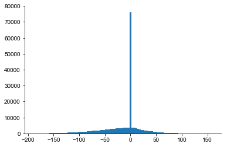
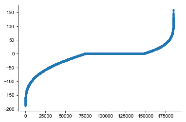

```python
import numpy as np
import matplotlib.pyplot as plt

from pathlib import Path
```


```python
root = Path('/Users/shhong/Dropbox/network_data/output_brep_2')
```


```python
root
```


    PosixPath('/Users/shhong/Dropbox/network_data/output_brep_2')


```python
xyz = np.loadtxt(root / "GoCcoordinates.sorted.dat")
dist0 = np.loadtxt(root / "GoCtoGoCdistances.dat")
```


```python
src = np.loadtxt(root / "GoCtoGoCsources.dat").astype(int)
tgt = np.loadtxt(root / "GoCtoGoCtargets.dat").astype(int)
```


```python
axon0 = np.loadtxt(root / "GoCaxoncoordinates.sorted.dat")
```


```python
axon0.shape
npoints = int(axon0.shape[1]/3)
```


```python
# axon = [np.vstack([x[:3], x.reshape(npoints, 3)[1::2]]) for x in axon0]
axon = [x.reshape(npoints, 3)[1::2] for x in axon0]
axon[0]
```


    array([[ 219. ,  -10.5,   23. ],
           [ 187. ,  104.5,   -4. ],
           [ 244. ,  102.5,  -50. ],
           [ 194. ,   69.5,   71. ],
           [ 246. ,   -1.5,   32. ],
           [ 220. ,  -69.5,  -24. ],
           [ 205. ,  -76.5,  -22. ],
           [ 211. ,    6.5,  -51. ],
           [ 261. ,  117.5,   67. ],
           [ 242. ,  143.5,   96. ],
           [ 181. ,   10.5,   62. ],
           [ 202. ,   62.5,  -23. ],
           [ 251. ,  -20.5,   43. ],
           [ 199. ,   57.5,    5. ],
           [ 193. , -107.5,   14. ],
           [ 258. ,   94.5,   -4. ],
           [ 174. ,   61.5,   45. ],
           [ 210. , -161.5,   34. ],
           [ 194. ,  116.5,   68. ],
           [ 240. ,  125.5,   33. ]])


```python
from tqdm import tqdm_notebook
colx = {}
for i in tqdm_notebook(range(ncell)):
    for j in range(ncell):
        if i!=j:
#         i = 1759
#         j = 1936
            di, ii = cKDTree(axon[i]).query(xyz[j])
            axon_len = np.sqrt(np.sum((axon[i][ii]-xyz[i])**2))
#             print(di, axon_len, axon_len+di)
            if di<100:
                colx[(i, j)] = axon_len + di
            
```


    HBox(children=(IntProgress(value=0, max=1995), HTML(value='')))


```python
il, = np.where(np.logical_and(src==i, tgt==j))
il
```


    array([42039])


```python
dist0[il]
```


    array([282.05695718])


```python
axon[[1,2]]
```


    ---------------------------------------------------------------------------

    TypeError                                 Traceback (most recent call last)

    <ipython-input-88-87025d381535> in <module>
    ----> 1 axon[[1,2]]
    

    TypeError: list indices must be integers or slices, not list


```python
ncell = 1995
ncoords = int(axon.shape[0]/ncell)
```


```python
cellind!=0
```


    array([False, False, False, ...,  True,  True,  True])


```python
cellind.shape
```


    (79800,)


```python
axon.shape
```


    (79800, 3)


```python
xyz[0]
```


    array([219.,   0.,  23.])


```python
cellind[cellind!=i][1173]
```


    30


```python
len(colx.keys())
```


    256440


```python
src.size
```


    184684


```python
i = 0
s, t = src[i], tgt[i]
print(s, t)
print(colx[(s, t)])
print(dist0[i])
```

    1921 1920
    53.86294886692424
    98.2372633010221


```python
colx[(t, s)]
```


    143.14873147064438


```python
s, t
di, ii = cKDTree(axon[s]).query(xyz[t])
axon_len = np.sqrt(np.sum((axon[s][ii]-xyz[s])**2))
print(s, t, di, axon_len)
```

    1921 1920 34.07345007480164 0.0


```python
dd[np.logical_and(dd[:,0]==s, dd[:,1]==t),2]
```


    array([122.95527642])


```python
dd = np.array([colx[(src[i], tgt[i])]-dist0[i] for i, _ in enumerate(src) if (src[i], tgt[i]) in colx.keys()])
```


```python
_ = plt.hist(dd,100)
```





```python
plt.plot(np.sort(dd),'.')
```


    [<matplotlib.lines.Line2D at 0x631325cc0>]





# ??


```python
xyz[t]
```


    array([1350.,  511.,  108.])


```python
dd = np.loadtxt(root / "GoCdistances0.dat")
```


```python
plt.plot(dd)
```


    ---------------------------------------------------------------------------

    NameError                                 Traceback (most recent call last)

    <ipython-input-238-e0f851c5a5c0> in <module>
    ----> 1 plot(dd)
    

    NameError: name 'plot' is not defined


```python
len(colx.keys())
```


    256263


