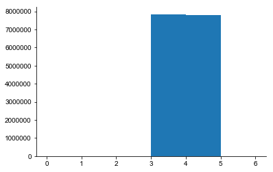
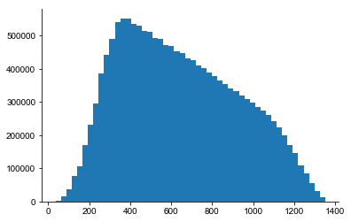
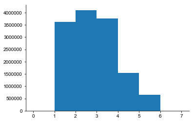
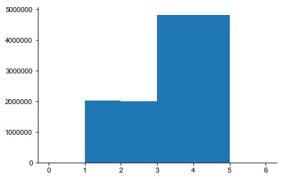
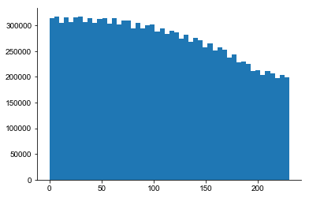
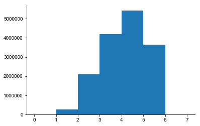
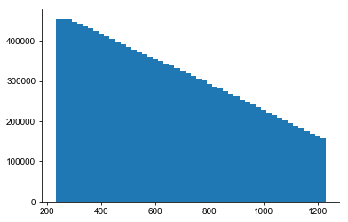

```python
import numpy as np
import matplotlib.pyplot as plt
```


```python
from joblib import Parallel, delayed
```


```python
from pathlib import Path
dataroot = Path('/Users/shhong/Dropbox/network_data/output_brep_2')
```


```python
from tqdm import tnrange
aasrc = np.hstack([np.loadtxt(dataroot / 'AAtoGoCsources{}.dat'.format(i)) for i in tnrange(120)])
aatgt = np.hstack([np.loadtxt(dataroot / 'AAtoGoCtargets{}.dat'.format(i)) for i in tnrange(120)])
```


    HBox(children=(IntProgress(value=0, max=120), HTML(value='')))


```python
np.min(aasrc), np.max(aasrc)
```


    (1.0, 797999.0)


```python
pfsrc = np.hstack([np.loadtxt(dataroot / 'PFtoGoCsources{}.dat'.format(i)) for i in tnrange(120)])
pftgt = np.hstack([np.loadtxt(dataroot / 'PFtoGoCtargets{}.dat'.format(i)) for i in tnrange(120)])

```


    HBox(children=(IntProgress(value=0, max=120), HTML(value='')))


    HBox(children=(IntProgress(value=0, max=120), HTML(value='')))


```python
np.min(pfsrc), np.max(pfsrc)
```


    (0.0, 797999.0)


```python
np.min(pftgt), np.max(pftgt)
```


    (0.0, 1994.0)


```python
naacons = aasrc.size
npfcons = pfsrc.size
naacons, npfcons
```


    (13772965, 15642772)


```python
(naacons/(np.max(pftgt)+1), npfcons/(np.max(pftgt)+1))
```


    (6903.741854636592, 7840.988471177945)


```python
(naacons/(np.max(pfsrc)+1), npfcons/(np.max(pfsrc)+1))
```


    (17.25935463659148, 19.602471177944864)


## BREP 1


```python
dataroot = Path('/Users/shhong/Dropbox/network_data/output_brep_1')
aasrc = np.hstack([np.loadtxt(dataroot / 'AAtoGoCsources{}.dat'.format(i)) for i in tnrange(120)])
aatgt = np.hstack([np.loadtxt(dataroot / 'AAtoGoCtargets{}.dat'.format(i)) for i in tnrange(120)])
pfsrc = np.hstack([np.loadtxt(dataroot / 'PFtoGoCsources{}.dat'.format(i)) for i in tnrange(120)])
pftgt = np.hstack([np.loadtxt(dataroot / 'PFtoGoCtargets{}.dat'.format(i)) for i in tnrange(120)])
```


    HBox(children=(IntProgress(value=0, max=120), HTML(value='')))


    HBox(children=(IntProgress(value=0, max=120), HTML(value='')))


    HBox(children=(IntProgress(value=0, max=120), HTML(value='')))


    HBox(children=(IntProgress(value=0, max=120), HTML(value='')))


```python
print((np.min(pfsrc), np.max(pfsrc)))
print((np.min(pftgt), np.max(pftgt)))
naacons = aasrc.size
npfcons = pfsrc.size
naacons, npfcons
```

    (0.0, 797999.0)
    (0.0, 1994.0)


    (13674411, 15651755)


```python
aaseg = np.vstack([np.loadtxt(dataroot / 'AAtoGoCsegments{}.dat'.format(i)) for i in tnrange(120)])
```


    HBox(children=(IntProgress(value=0, max=120), HTML(value='')))


```python
np.min(aaseg[:,0]), np.max(aaseg[:,0])
```


    (1.0, 5.0)


```python
np.min(aaseg[:,1]), np.max(aaseg[:,1])
```


    (1.0, 4.0)


```python
plt.hist(aaseg[:,0],np.arange(0,8))
```


    (array([      0., 3627469., 4101815., 3758054., 1547149.,  639924.,
                  0.]),
     array([0, 1, 2, 3, 4, 5, 6, 7]),
     <a list of 7 Patch objects>)


```python
plt.hist(aaseg[:,1],np.arange(0,7))
```


    (array([      0., 2030424., 2001638., 4823136., 4819213.,       0.]),
     array([0, 1, 2, 3, 4, 5, 6]),
     <a list of 6 Patch objects>)


```python
aadst = np.hstack([np.loadtxt(dataroot / 'AAtoGoCdistances{}.dat'.format(i)) for i in tnrange(120)])
```


    HBox(children=(IntProgress(value=0, max=120), HTML(value='')))


```python
plt.hist(aadst,50)
```


    (array([313752., 316521., 304466., 315060., 305929., 315910., 317399.,
            306182., 314467., 304850., 312476., 314099., 303533., 314564.,
            301152., 309691., 309091., 293301., 304394., 294612., 300433.,
            301852., 288112., 294530., 282849., 290021., 286675., 274186.,
            281122., 267991., 275129., 271197., 257849., 264336., 250547.,
            257428., 251895., 237220., 242735., 228153., 229082., 224554.,
            211327., 212383., 203773., 210851., 206196., 197725., 203783.,
            199028.]),
     array([  0. ,   4.6,   9.2,  13.8,  18.4,  23. ,  27.6,  32.2,  36.8,
             41.4,  46. ,  50.6,  55.2,  59.8,  64.4,  69. ,  73.6,  78.2,
             82.8,  87.4,  92. ,  96.6, 101.2, 105.8, 110.4, 115. , 119.6,
            124.2, 128.8, 133.4, 138. , 142.6, 147.2, 151.8, 156.4, 161. ,
            165.6, 170.2, 174.8, 179.4, 184. , 188.6, 193.2, 197.8, 202.4,
            207. , 211.6, 216.2, 220.8, 225.4, 230. ]),
     <a list of 50 Patch objects>)


```python
pfseg = np.vstack([np.loadtxt(dataroot / 'PFtoGoCsegments{}.dat'.format(i)) for i in tnrange(120)])
```


    HBox(children=(IntProgress(value=0, max=120), HTML(value='')))


```python
plt.hist(pfseg[:,0],np.arange(0,8))
```


    (array([      0.,  263880., 2125051., 4161063., 5424508., 3668270.,
                  0.]),
     array([0, 1, 2, 3, 4, 5, 6, 7]),
     <a list of 7 Patch objects>)


```python
plt.hist(pfseg[:,1],np.arange(0,7))
```


    (array([      0.,       0.,       0., 7842881., 7799891.,       0.]),
     array([0, 1, 2, 3, 4, 5, 6]),
     <a list of 6 Patch objects>)





```python
pfdst = np.hstack([np.loadtxt(dataroot / 'PFtoGoCdistances{}.dat'.format(i)) for i in tnrange(120)])
```


    HBox(children=(IntProgress(value=0, max=120), HTML(value='')))


```python
plt.hist(pfdst,50)
```


    (array([  2071.,  14698.,  36220.,  76550., 106884., 170115., 232142.,
            294902., 385904., 440459., 489110., 541065., 550268., 551756.,
            533721., 529996., 512412., 510617., 492040., 489401., 472013.,
            467624., 451970., 446550., 431201., 425090., 409163., 402245.,
            387841., 378981., 364379., 354430., 341225., 332106., 319096.,
            308107., 297230., 285833., 274891., 259604., 241293., 222852.,
            198298., 171282., 146580., 109956.,  84008.,  54462.,  30343.,
             13788.]),
     array([  35.28177995,   61.61079197,   87.939804  ,  114.26881602,
             140.59782804,  166.92684007,  193.25585209,  219.58486411,
             245.91387614,  272.24288816,  298.57190018,  324.90091221,
             351.22992423,  377.55893626,  403.88794828,  430.2169603 ,
             456.54597233,  482.87498435,  509.20399637,  535.5330084 ,
             561.86202042,  588.19103244,  614.52004447,  640.84905649,
             667.17806851,  693.50708054,  719.83609256,  746.16510458,
             772.49411661,  798.82312863,  825.15214065,  851.48115268,
             877.8101647 ,  904.13917672,  930.46818875,  956.79720077,
             983.1262128 , 1009.45522482, 1035.78423684, 1062.11324887,
            1088.44226089, 1114.77127291, 1141.10028494, 1167.42929696,
            1193.75830898, 1220.08732101, 1246.41633303, 1272.74534505,
            1299.07435708, 1325.4033691 , 1351.73238112]),
     <a list of 50 Patch objects>)





## PyBREP


```python
dataroot = Path('/Users/shhong/Dropbox/network_data/model_pybrep_output')
aasrc = np.hstack([np.loadtxt(dataroot / 'AAtoGoCsources{}.dat'.format(i)) for i in tnrange(120)])
aatgt = np.hstack([np.loadtxt(dataroot / 'AAtoGoCtargets{}.dat'.format(i)) for i in tnrange(120)])
pfsrc = np.hstack([np.loadtxt(dataroot / 'PFtoGoCsources{}.dat'.format(i)) for i in tnrange(120)])
pftgt = np.hstack([np.loadtxt(dataroot / 'PFtoGoCtargets{}.dat'.format(i)) for i in tnrange(120)])
```


    HBox(children=(IntProgress(value=0, max=120), HTML(value='')))


    HBox(children=(IntProgress(value=0, max=120), HTML(value='')))


    HBox(children=(IntProgress(value=0, max=120), HTML(value='')))


    HBox(children=(IntProgress(value=0, max=120), HTML(value='')))


```python
np.min(pfsrc), np.max(pfsrc)
```


    (0.0, 797999.0)


```python
np.min(pftgt), np.max(pftgt)
```


    (0.0, 1994.0)


```python
naacons = aasrc.size
npfcons = pfsrc.size
naacons, npfcons
```


    (13674411, 15651755)


```python
(naacons/(np.max(pftgt)+1), npfcons/(np.max(pftgt)+1))
```


    (6854.341353383458, 7845.491228070176)


```python
(naacons/(np.max(pfsrc)+1), npfcons/(np.max(pfsrc)+1))
```


    (17.135853383458645, 19.613728070175437)


```python
aaseg = np.vstack([np.loadtxt(dataroot / 'AAtoGoCsegments{}.dat'.format(i)) for i in tnrange(120)])
```


    HBox(children=(IntProgress(value=0, max=120), HTML(value='')))


```python
np.min(aaseg[:,0]), np.max(aaseg[:,0])
```


    (1.0, 5.0)


```python
np.min(aaseg[:,1]), np.max(aaseg[:,1])
```


    (1.0, 4.0)


```python
plt.hist(aaseg[:,0],np.arange(0,8))
```


    (array([      0., 3627469., 4101815., 3758054., 1547149.,  639924.,
                  0.]),
     array([0, 1, 2, 3, 4, 5, 6, 7]),
     <a list of 7 Patch objects>)





```python
plt.hist(aaseg[:,1],np.arange(0,7))
```


    (array([      0., 2030424., 2001638., 4823136., 4819213.,       0.]),
     array([0, 1, 2, 3, 4, 5, 6]),
     <a list of 6 Patch objects>)





```python
aadst = np.hstack([np.loadtxt(dataroot / 'AAtoGoCdistances{}.dat'.format(i)) for i in tnrange(120)])
```


    HBox(children=(IntProgress(value=0, max=120), HTML(value='')))


```python
plt.hist(aadst,50)
```


    (array([313752., 316521., 304466., 315060., 305929., 315910., 317399.,
            306182., 314467., 304850., 312476., 314099., 303533., 314564.,
            301152., 309691., 309091., 293301., 304394., 294612., 300433.,
            301852., 288112., 294530., 282849., 290021., 286675., 274186.,
            281122., 267991., 275129., 271197., 257849., 264336., 250547.,
            257428., 251895., 237220., 242735., 228153., 229082., 224554.,
            211327., 212383., 203773., 210851., 206196., 197725., 203783.,
            199028.]),
     array([  0. ,   4.6,   9.2,  13.8,  18.4,  23. ,  27.6,  32.2,  36.8,
             41.4,  46. ,  50.6,  55.2,  59.8,  64.4,  69. ,  73.6,  78.2,
             82.8,  87.4,  92. ,  96.6, 101.2, 105.8, 110.4, 115. , 119.6,
            124.2, 128.8, 133.4, 138. , 142.6, 147.2, 151.8, 156.4, 161. ,
            165.6, 170.2, 174.8, 179.4, 184. , 188.6, 193.2, 197.8, 202.4,
            207. , 211.6, 216.2, 220.8, 225.4, 230. ]),
     <a list of 50 Patch objects>)





```python
pfseg = np.vstack([np.loadtxt(dataroot / 'PFtoGoCsegments{}.dat'.format(i)) for i in tnrange(120)])
```


    HBox(children=(IntProgress(value=0, max=120), HTML(value='')))


```python
plt.hist(pfseg[:,0],np.arange(0,8))
```


    (array([      0.,  257202., 2106728., 4193520., 5438279., 3656026.,
                  0.]),
     array([0, 1, 2, 3, 4, 5, 6, 7]),
     <a list of 7 Patch objects>)





```python
plt.hist(pfseg[:,1],np.arange(0,7))
```


    (array([      0.,       0.,       0., 7842965., 7808790.,       0.]),
     array([0, 1, 2, 3, 4, 5, 6]),
     <a list of 6 Patch objects>)


```python
pfdst = np.hstack([np.loadtxt(dataroot / 'PFtoGoCdistances{}.dat'.format(i)) for i in tnrange(120)])
```


    HBox(children=(IntProgress(value=0, max=120), HTML(value='')))


```python
plt.hist(pfdst,50)
```


    (array([455917., 455604., 452458., 446845., 442284., 437441., 430643.,
            423857., 416849., 410942., 403588., 398779., 392504., 384923.,
            378301., 371648., 366581., 360590., 354730., 348617., 342289.,
            337606., 331983., 326090., 319165., 312122., 306635., 300923.,
            293426., 286433., 280745., 274716., 267546., 261370., 253386.,
            247750., 241573., 234337., 227688., 220711., 214929., 207936.,
            201058., 194652., 187749., 181210., 175344., 168662., 163030.,
            157590.]),
     array([ 230.        ,  249.9999998 ,  269.9999996 ,  289.99999939,
             309.99999919,  329.99999899,  349.99999879,  369.99999858,
             389.99999838,  409.99999818,  429.99999797,  449.99999777,
             469.99999757,  489.99999737,  509.99999716,  529.99999696,
             549.99999676,  569.99999655,  589.99999635,  609.99999615,
             629.99999594,  649.99999574,  669.99999554,  689.99999534,
             709.99999513,  729.99999493,  749.99999473,  769.99999452,
             789.99999432,  809.99999412,  829.99999392,  849.99999371,
             869.99999351,  889.99999331,  909.9999931 ,  929.9999929 ,
             949.9999927 ,  969.9999925 ,  989.99999229, 1009.99999209,
            1029.99999189, 1049.99999168, 1069.99999148, 1089.99999128,
            1109.99999107, 1129.99999087, 1149.99999067, 1169.99999047,
            1189.99999026, 1209.99999006, 1229.99998986]),
     <a list of 50 Patch objects>)





```python
min(pfdst)
```


    230.00000000334592


